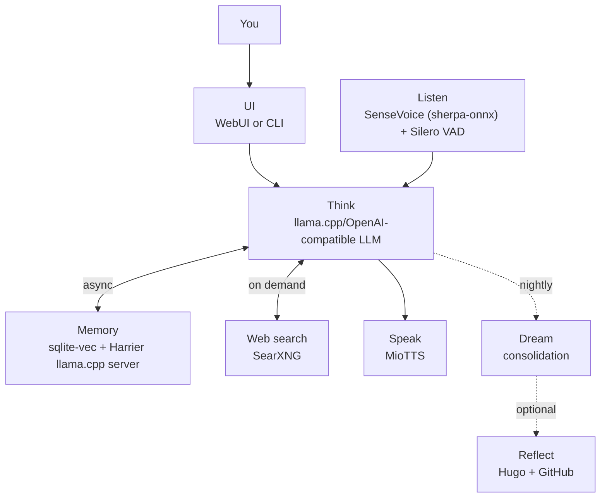

# Aiko-chan アイコちゃん

> A local-first AI companion with a browser WebUI + VRM avatar, optional simple CLI, persistent memory, web search, microphone input, and MioTTS voice output.
> Optimised for constrained hardware — runs on a Jetson Orin Nano with 8GB unified RAM.

**Author:** [OppaAI](https://github.com/OppaAI) · Beautiful British Columbia, Canada

[](https://github.com/OppaAI/Aiko-chan)
[](https://opensource.org/licenses/Apache-2.0)


---

## Status

Phase 2 voice is implemented, and Phase 2.5 agentic workflows are now active. The default launch path is the browser WebUI/VRM frontend, including a WebSocket bridge for chat, vitals, voice status, expression, viseme, and browser microphone events. `--cli` remains available for simple local testing.

ASR and TTS run through the local machine by default. WebUI microphone streaming exists in the frontend/backend bridge, but full remote voice-device polish is still experimental.

> **Known Issues:**
> - TTS via MioTTS sometimes cannot inference proper voice output due to memory constraint (MioTTS and embedding models are still tuned for Jetson memory pressure; Harrier replaced BGE for better semantic separation at 640d)
> - Time latency between ASR voice input ends to beginning of TTS voice output are still over 5 sec for normal chats. Need to figure out how to do proper synchronized text and speech streaming to save a couple seconds.
> - ASR may have transcribing errors that output wrong text or even wrong language, especially when accent is present in speaker's voice or when using low quality microphone.
> - Barge-in haven't been fully tested and may cause some runtime issues that needed to conduct more testing and debugging.

---

## Demo

> Click the following image to watch on YouTube ▶

[](https://youtu.be/SKvZQcFN6vo)

---

## Purpose

This project currently serves as:

- a local AI companion chatbot with persistent memory, web search, TTS, ASR, a terminal UI, and an optional browser WebUI/VRM avatar;
- a stress test for running a full conversational stack on constrained hardware such as an 8 GB VRAM GPU or Jetson Orin Nano;
- a precursor and testing sandbox for the larger Grace / AuRoRA project;
- an experimental playground for memory decay, nightly consolidation, daily reflection publishing, agentic tools, scheduled reminders, and workflow skills.

---

## Features

### 💬 Conversational Core
- **Local-first LLM** — OpenAI-compatible endpoint (llama.cpp `llama-server` recommended), runs entirely on your hardware
- **Curses TUI** — Full-screen cyberpunk terminal interface with streaming tokens, status panels, and command palette
- **Browser WebUI (optional)** — Modern web interface with VRM avatar, WebSocket bridge, browser microphone streaming
- **Persona system** — Rich personality defined in `persona/soul.md` with identity, skills, and user profile

### 🧠 Persistent Memory
- **sqlite-vec + custom Harrier ONNX embedder** — Serverless vector store, no Qdrant/mem0 required
- **Hybrid retrieval** — KNN vector + FTS5 lexical + Reciprocal Rank Fusion
- **Ebbinghaus-style decay** — Memories fade naturally unless pinned
- **Pinned memories** — `/remember` command makes memories decay-proof
- **Nightly dream consolidation** — Midnight `dream()` merges near-duplicates, prunes decayed memories, pins daily summaries
- **Monthly consolidation** — Older full months summarized into durable pinned memories
- **Encrypted storage option** — SQLCipher via `AIKO_SQLITE_ENCRYPTION=1` for per-user encrypted databases

### 🔍 Web Search & Research
- **Local SearXNG** — Private web search instance via Docker
- **`/web <query>` command** — Grounded answers with source citations
- **Deep research tool** — Multi-step search, fetch, and synthesis for agentic tasks

### 🎤 Voice
- **ASR** — SenseVoice via sherpa-onnx (int8 ONNX, multilingual JP/EN)
- **VAD** — Silero VAD for voice activity detection
- **Microphone** — PulseAudio `parec` capture (local) + browser WebAudio Worklet (WebUI)
- **Barge-in** — Speak over Aiko mid-response to interrupt
- **Speaker verification** — Optional sherpa-onnx speaker embeddings for owner-only voice activation
- **TTS** — MioTTS HTTP server (0.4B Q4KM), bilingual JP/EN, karaoke-style text sanitization
- **Staged warmup** — ASR, VAD, TTS, and microphone warmed during boot

### 🤖 Agentic Skills
- **ReAct task loop** — LLM plans, calls tools, observes, repeats until done
- **Toolkit modules** — Web search, fetch, planning, scheduling, workspace notes, photo ingestion, repo inspection
- **Skill registry** — Markdown workflow definitions in `skills/skillsets/*.md`
- **Skill context injection** — Relevant skill instructions automatically retrieved in agentic mode
- **Dual-path routing** — Fast semantic exemplar routing (default) + optional LLM router fallback
- **Final-answer verification** — Self-critique and repair loop for tool outputs
- **Scheduling & reminders** — Per-user `schedule.json` with cron-like recurrence, due announcements
- **Workspace tools** — Safe note-taking, file reads, photo scanning under `WORKSPACE_ROOT`

### 🌙 Nightly Dream Pipeline
- **Midnight scheduler** — Runs automatically at configurable hour
- **Salient memory boost** — Important memories reinforced
- **Near-duplicate merging** — Vector similarity deduplication
- **Decay pruning** — Low-score memories removed
- **Daily reflection** — Optional Hugo + GitHub Pages blog publishing
- **Cross-session coherence** — Ongoing improvements to memory continuity

### 👥 Multi-User Support (Experimental)
- **OAuth identity** — Provider-scoped user IDs (`github_123`, `patreon_456`)
- **Per-user isolation** — `~/.aiko/<user_id>/{memory.db, schedule.json, workspace/, user}`
- **SQLCipher encryption** — Per-user encrypted databases with server-secret derived keys
- **Workspace isolation** — Per-user workspaces, future Google Drive mount support

### 🎭 WebUI / VRM Frontend (Experimental)
- **three.js + @pixiv/three-vrm** — Browser-rendered VRM avatar
- **WebSocket bridge** — Real-time chat, vitals, voice state, expressions, visemes
- **Browser microphone** — AudioWorklet PCM capture → Silero VAD → backend ASR
- **Expression system** — Idle, happy, annoyed, flustered, thinking (planned)
- **Lip-sync** — Viseme-driven from TTS audio (planned)

---

## Documentation

| Document | Description |
|---|---|
| [docs/INSTALL.md](docs/INSTALL.md) | Step-by-step installation for every component |
| [docs/HISTORY.md](docs/HISTORY.md) | How Aiko evolved from a chatbot into a companion |
| [docs/ROADMAP.md](docs/ROADMAP.md) | Detailed phase-by-phase feature roadmap |
| [docs/TESTS.md](docs/TESTS.md) | Manual smoke-test checklist for each phase |
| [docs/MULTI_USER.md](docs/MULTI_USER.md) | Multi-user isolation, encryption, and deployment notes |
| [docs/ARCHITECTURE.md](docs/ARCHITECTURE.md) | Runtime architecture, module boundaries, and data flows |

---

## Architecture



---

## Stack

| Layer | Implementation |
|---|---|
| Entry point | `main.py` (browser WebUI default, `--cli` optional simple CLI) |
| Interface | browser WebUI in `interface/webui/` by default; simple local CLI via `--cli` |
| Chat model | llama.cpp or any OpenAI-compatible local server via `openai.OpenAI` |
| Long-term memory | custom sqlite-vec backend (no server required) |
| Embeddings | Harrier llama.cpp, `harrier-oss-v1-270m via llama.cpp server` |
| Memory lifecycle | Ebbinghaus-style decay, pinned memories, nightly `dream()` consolidation |
| Web search | local SearXNG instance through `toolkit/research.py` |
| TTS | external MioTTS HTTP server |
| ASR | SenseVoice via sherpa-onnx with Silero VAD |
| Reflection publishing | optional GitHub REST API + Hugo markdown |
| Agentic task mode | `skills/agentic.py` ReAct loop + `toolkit/tools.py` facade + `toolkit/` modules |
| Skills | `skills/skillsets/*.md` workflow registry loaded by `skills/skills.py` |
| Scheduling | local schedule/reminder runner using `~/.aiko/<user_id>/schedule.json` |
| Multi-user | OAuth provider-scoped IDs, per-user `~/.aiko/<user_id>/` isolation |
| Encryption | optional SQLCipher via `AIKO_SQLITE_ENCRYPTION=1` |

---

## Quickstart

**Prerequisites:** Python 3.12, [uv](https://astral.sh/uv), CUDA 12.6, Docker + Compose, a llama.cpp/OpenAI-compatible local LLM server, and a pulled/served chat model (3B+ recommended).

> Full installation walkthrough → **[docs/INSTALL.md](docs/INSTALL.md)**

```bash
git clone https://github.com/OppaAI/Aiko-chan.git
cd Aiko-chan
cp .env.example .env        # fill secrets only; edit config/*.yaml for settings
docker compose up -d
uv sync
uv run python main.py            # browser WebUI, full voice if services are available
```

```bash
uv run python main.py --text      # WebUI keyboard input, ASR/TTS toggled off but loaded
uv run python main.py --cli       # simple authenticated local CLI
uv run python main.py --debug     # show memory hits each turn
uv run python main.py --clear-mem # wipe all memories and exit
```

---

## In-App Commands

| Command | Action |
|---|---|
| `/quit` or `/exit` | End the session |
| `/reset` | Clear short-term context; long-term memory persists |
| `/memory` | Print all stored memories |
| `/clear` | Wipe all long-term memories |
| `/remember` | Pin the last exchange — decay-proof |
| `/think <question>` | Higher-token reasoning turn; suppresses `🤔` scratchpad |
| `/web <query>` | SearXNG search → grounded answer |
| `/voice` | Toggle TTS on/off |
| `/listen` | Toggle ASR on/off |
| `/proactive` | Toggle proactive idle check-ins on/off; timing, quiet/focus windows, and prompt hints configured in `config/proactive.yaml` |
| `/help` | Show the command list |

---

## Project Structure

```text
Aiko-chan/
├── main.py                 # entry point; WebUI default, --cli for simple local testing
├── config/                 # category YAML settings; secrets stay in .env
├── cognition/
│   ├── think.py            # chat facade, routing, history, scheduled-job callbacks
│   └── reason.py           # shared embedding/ranking helpers
├── memory/
│   ├── memorize.py         # sqlite-vec memory, recall, pinned memories
│   ├── vecstore.py         # SQLite/sqlite-vec helpers
│   ├── forget.py           # decay scoring and cleanup gates
│   ├── consolidate.py      # periodic memory consolidation
│   ├── journal.py          # encrypted journal blob store
│   └── reflect.py          # Hugo/GitHub reflection publisher
├── sensory/
│   ├── speak.py            # MioTTS HTTP client
│   └── listen.py           # SenseVoice (sherpa-onnx) + Silero VAD
├── skills/
│   ├── agentic.py          # ReAct task loop, tool schemas, tool dispatch
│   ├── schema.py           # graph-first master-plan DAG executor
│   ├── capability.py       # capability matching for task-mode tool filtering
│   ├── experience.py       # procedural task-run experience store
│   ├── skills.py           # skill registry and workflow retrieval
│   ├── wiki.py             # wiki-card retrieval for task mode
│   └── skillsets/          # human-readable workflow documents
├── toolkit/                # executable tools: research, planning, schedule, photo, repo, jobs
├── system/                 # config, wakeup, schedule runner, logging, userspace
├── interface/
│   ├── webui/              # browser WebUI backend + static frontend/VRM bridge
│   └── cli/                # auth and simple CLI helpers
├── persona/                # soul/personality and prompt policy files
├── wiki/                   # trusted local knowledge cards
├── docs/                   # install, architecture, roadmap, tests, history
├── assets/                 # images and VRM assets
├── docker-compose.yml
├── pyproject.toml
├── uv.lock
├── .env.example
└── README.md
```

---

## Roadmap

| Phase | Name | Status |
|---|---|---|
| 1 | Soul — CLI, Ollama, mem0 + Qdrant, SearXNG | ✅ Done |
| 1.5 | Stream — streaming pipeline, persona, first UI, test TTS models | ✅ Done |
| 2 | Voice — SenseVoice ASR, Silero VAD, MioTTS, hands-free talk | ✅ Done |
| 2.5 | Agent — tool registry, skill workflows, scheduled local tasks | ✅ Active |
| 3 | Face — VRM avatar, three-vrm, expressions, lip-sync | 🔲 Planned |
| 4 | Presence — emotional state, mood, relationship progression | 🔲 Planned |
| 5 | Mobile — React Native / Flutter, WAN, push notifications | 🔲 Planned |
| 6 | Multimodal — camera, vision input, webcam expression awareness | 🔲 Planned |
| 7 | Autonomy — scheduled operation, self-directed exploration | 🔲 Planned |

Full details → **[docs/ROADMAP.md](docs/ROADMAP.md)**

---

## Configuration

All non-secret runtime settings live in `config/*.yaml`. Environment variables in `.env` override YAML at runtime.

| Config file | Purpose |
|---|---|
| `config/index.yaml` | Ordered list of YAML files loaded at startup |
| `config/system.yaml` | Identity, logging, userspace, schedule, reflection/social settings |
| `config/cognition.yaml` | LLM endpoints, routing, token limits, vector-cache settings |
| `config/memory.yaml` | Memory, embedding, decay, experience, consolidation settings |
| `config/skills.yaml` | Agentic routing thresholds, tool configs, graph executor settings |
| `config/sensory.yaml` | MioTTS, ASR, VAD, speaker verification, and barge-in settings |
| `config/interface.yaml` | WebUI ports, avatar path, streaming behavior |

---

## Architecture Changes from Previous Phases

| Phase | Before | After |
|---|---|---|
| 1 → 1.5 | CLI + Ollama + mem0/Qdrant | Browser WebUI + llama.cpp + streaming |
| 1.5 → 2 | Text-only | Voice loop: SenseVoice + Silero VAD + MioTTS |
| 2 | mem0 + Qdrant (server, OOM on Jetson) | **sqlite-vec + custom Harrier ONNX (serverless, local)** |
| 2 | fastembed (BGE v1.5) | **Harrier OSS v1 270M Q8 GGUF embedder (640d, last-token pooling)** |
| 2 → 2.5 | Chat only | **Agentic ReAct loop + skills + scheduling + toolkit** |
| 2.5 | Keyword-only routing | **Dual-path: semantic exemplar + optional LLM router** |

Key architectural decisions:
- **No external memory server** — sqlite-vec runs in-process, zero Docker deps for memory
- **Harrier over BGE** — Newer 640-dim decoder-only embedder with query instructions, better semantic separation
- **Custom ONNX embedder** — Harrier needs last-token pooling; fastembed only exposed MEAN/CLS
- **Tools ≠ Skills** — Tools are executable Python functions; skills are human-readable Markdown workflows
- **Single agentic loop** — Semantic routing + optional LLM routing + ReAct + skills = one coherent task layer

---

## Notes

- Memory uses a custom sqlite-vec backend — no Qdrant server or mem0 required. Qdrant + mem0 were dropped in Phase 2 due to OOM issues on the Jetson Orin Nano.
- Entry point is `main.py`, not `cli.py` anymore.
- LLM runtime is now an OpenAI-compatible endpoint (`LLM_BASE_URL`/`LLM_MODEL`), usually llama.cpp `llama-server`; older Ollama-specific settings are archived/outdated.
- TTS runtime is MioTTS server with 0.4B Q4KM model (Tried XTTS with CoquiTTS, Kokoro and RealtimeTTS, PocketTTS but removed due to Jetson OOM/latency/quality tradeoffs).
- ASR runtime is SenseVoice via sherpa-onnx with Silero VAD. (Tried ReazonSpeech K2 and faster-whisper but removed due to English capability and RAM usage tradeoffs respectively)
- Reflection publishing fails safely if `GITHUB_TOKEN` or `GITHUB_REPO` are missing.
- Multi-user isolation uses per-user directories under `~/.aiko/<user_id>/` with optional SQLCipher encryption.
- WebUI VRM frontend is experimental; remote voice device polish is ongoing.

---

## Support

If you find this project useful, consider buying me a coffee ☕

[](https://ko-fi.com/oppaai)
