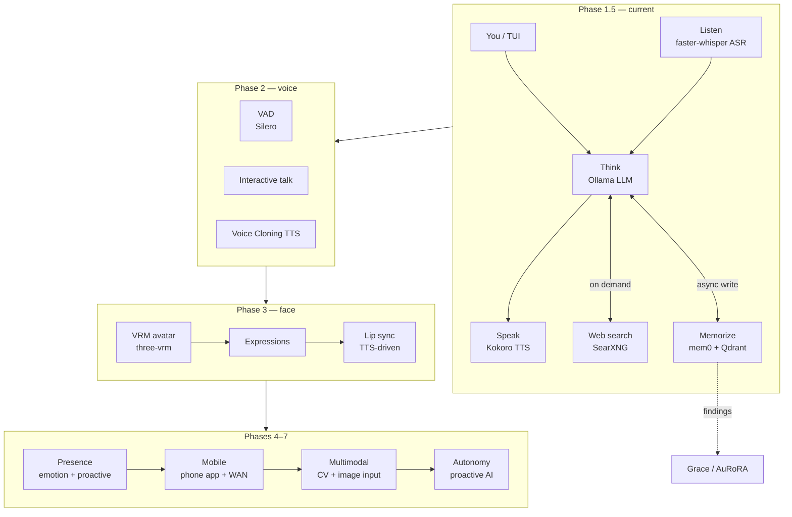

# Aiko-chan 愛子ちゃん

> Aiko is a local-first AI companion with a curses TUI, persistent memory, web search, microphone input, and MioTTS voice output.
>
> The current code is optimized for a small local/Jetson-style setup: Ollama for the chat model, Qdrant for memory storage, fastembed for local embeddings, SearXNG for web search, faster-whisper + Silero VAD for speech input, and an external MioTTS HTTP server for speech output.

## Purpose

This project currently serves as:

- a local AI companion chatbot with persistent memory, web search, TTS, ASR, and a terminal UI;
- a stress test for running a full conversational stack on constrained hardware such as an 8 GB VRAM GPU or Jetson Orin Nano;
- a precursor and testing sandbox for the larger [Grace / AuRoRA](https://github.com/OppaAI/AGi) project;
- an experimental playground for memory decay, nightly consolidation, and daily reflection publishing.


## Current Architecture



---

## Stack

| Layer | Current implementation |
|---|---|
| Entry point | `main.py` |
| Interface | full-screen curses TUI in `tui/` |
| Chat model | Ollama via `ollama.Client` |
| Long-term memory | mem0 backed by Qdrant |
| Embeddings | fastembed with `BAAI/bge-base-en-v1.5` |
| Memory lifecycle | Ebbinghaus-style decay, pinned memories, nightly `dream()` consolidation |
| Web search | local SearXNG instance |
| TTS | external MioTTS HTTP server (`/health`, `/v1/tts`) |
| ASR | faster-whisper with Silero VAD microphone gating |
| Reflection publishing | optional GitHub REST API upload of Hugo markdown posts |

---

## Quickstart

### 1. Prerequisites

- Python **3.10** (`pyproject.toml` is pinned to `>=3.10,<3.11`).
- [uv](https://github.com/astral-sh/uv).
- Docker + Docker Compose for Qdrant and SearXNG.
- [Ollama](https://ollama.com) running locally or reachable over the network.
- A chat model configured in `.env` as `OLLAMA_MODEL`.
- Optional for voice mode:
  - a working microphone/audio output device;
  - a reachable MioTTS HTTP server at `MIOTTS_API_URL`.

> Note: this repo is configured for Jetson AI Lab wheels for `torch`, `torchaudio`, `torchvision`, and local wheel paths for `torch` and `ctranslate2`. Make sure the wheel paths in `pyproject.toml` exist on your machine before running `uv sync`.

### 2. Configure environment

```bash
cp .env.example .env
# edit .env for your Ollama URL/model, SearXNG secret, Qdrant host/port,
# MioTTS URL/preset, Whisper settings, and optional GitHub reflection settings
```

At minimum, verify these values:

```dotenv
OLLAMA_BASE_URL=http://localhost:11434
OLLAMA_MODEL=hf.co/unsloth/Ministral-3-3B-Reasoning-2512-GGUF:UD-Q4_K_XL
QDRANT_HOST=localhost
QDRANT_PORT=6333
SEARXNG_URL=http://localhost:8081
SEARXNG_SECRET=<secret_code>
MIOTTS_API_URL=http://localhost:8001
```

Qdrant dashboard: http://localhost:6333/dashboard

### 3. Start Qdrant + SearXNG

The `searxng/` directory in this repo contains the SearXNG config mounted by Docker Compose. `SEARXNG_URL` is the URL Aiko calls from the host, and `SEARXNG_BASE_URL` is set inside `docker-compose.yml` for the container.

```bash
docker compose up -d
```

Qdrant dashboard: <http://localhost:6333/dashboard>

### 4. Install dependencies

```bash
uv sync
```

### 5. Run Aiko-chan

```bash
# Full voice mode: ASR input + TTS output
uv run python main.py

# Text mode: keyboard input, no ASR/TTS
uv run python main.py --text

# Show retrieved memory hits each turn
uv run python main.py --debug

# Wipe all stored memories and exit
uv run python main.py --clear-mem
```

## In-App Commands

| Command | Action |
|---|---|
| `/quit` or `/exit` | End the session |
| `/reset` | Clear short-term chat context; long-term memory persists |
| `/memory` | Print all stored memories |
| `/clear` | Wipe all long-term memories from Qdrant/mem0 |
| `/remember` | Pin the last user + assistant exchange so it is decay-proof |
| `/think <question>` | Run a single higher-token reasoning turn and suppress the raw `<think>` scratchpad from the main stream |
| `/web <query>` | Run SearXNG search and ask Aiko to answer from the results |
| `/voice` | Toggle TTS on/off at runtime |
| `/listen` | Toggle ASR on/off at runtime |
| `/help` | Show the command list |

## Project Structure

```text
Aiko-chan/
├── main.py              # curses entry point and session orchestrator
├── core/
│   ├── think.py         # Ollama chat loop, streaming, web-search trigger, reasoning mode
│   ├── memorize.py      # mem0 + Qdrant wrapper, pinned memories, access tracking, dream pass
│   ├── forget.py        # pure memory-decay scoring and cleanup gates
│   ├── dream.py         # midnight scheduler for consolidation + reflection
│   ├── reflect.py       # optional Hugo/GitHub daily reflection writer
│   ├── speak.py         # MioTTS HTTP client and sounddevice playback
│   ├── listen.py        # microphone capture, Silero VAD, faster-whisper transcription
│   ├── tools.py         # SearXNG web search helper
│   ├── health.py        # system/vitals helpers for the TUI
│   ├── log.py           # rotating log setup
│   └── silence.py       # stderr suppression utility
├── tui/
│   ├── tui.py           # full-screen curses UI
│   └── identity.py      # persona/identity.md loader
├── persona/
│   ├── soul.md          # Aiko's personality, rules, and voice
│   └── identity.md      # banner text, ASCII art, and color map
├── searxng/
│   ├── settings.yml     # SearXNG settings mounted into the container
│   └── limiter.toml     # SearXNG limiter config
├── assets/              # README images
├── docker-compose.yml   # Qdrant + SearXNG services
├── pyproject.toml       # Python/uv dependency metadata
├── uv.lock              # uv lockfile
├── .env.example         # Environment variable reference
└── README.md            # This file
```

## Memory Lifecycle

Aiko's memory layer does more than simple storage:

1. Normal conversation queues memory writes through `AikoThink` and stores them in mem0/Qdrant.
2. Searches update `access_count` and `last_accessed_at` metadata in Qdrant.
3. `/remember` pins the previous turn so cleanup and dream pruning will not delete it.
4. Startup cleanup removes memories below the decay threshold after the grace period.
5. A background scheduler runs at local midnight and calls `dream()`:
   - boosts salient memories;
   - merges near-duplicates by vector similarity;
   - prunes decayed memories;
   - optionally writes and publishes a Hugo reflection post through GitHub if reflection env vars are configured.

## Roadmap

* [x] **Phase 1 — Soul**

  * CLI chatbot architecture.
  * Local inference via Ollama.
  * Persistent memory using mem0 + Qdrant.
  * Async memory writes.
  * Web search integration via SearXNG.

* [x] **Phase 1.5 — Stream**

  * Aiko-chan curses TUI with cyberpunk ASCII interface.
  * Streaming inference architecture overhaul.
  * Decoupled LLM → TTS pipeline.
  * Callback-based response streaming.
  * Realtime speech synthesis via Kokoro.
  * Background LLM warmup to eliminate cold-start latency.
  * Background TTS warmup to eliminate cold-start latency.
  * Soul persona system (`persona/soul.md`).
  * Identity metadata and character framework (`persona/identity.md`).
  * Architectural renaming (`brain → think`, `memory → memorize`).
  * Non-blocking memory queue worker.
  * Removal of synchronous memory write bottlenecks.
  * CLI execution flow refactor.
  * Command-line argument parser redesign.
  * Audio streaming stability improvements.
  * Search output filtering and instruction refinement.
  * Jetson AI Lab dependency migration.

* [ ] **Phase 2 — Voice**

  * Microphone input via faster-whisper.
  * Interactive Talk mode.
  * Voice Activity Detection (VAD).
  * Fully hands-free voice conversations on Jetson.
  * TTS voice cloning exploration and integration (eg. XTTS, PocketTTS)

* [ ] **Phase 3 — Face**

  * VRM/VRoid avatar support.
  * Browser-based rendering via `@pixiv/three-vrm`.
  * Expression system (idle, happy, annoyed, flustered, thinking).
  * Lip-sync driven by generated speech audio.
  * WebSocket bridge between Python backend and browser frontend.
  * Real-time avatar interaction.

* [ ] **Phase 4 — Presence**

  * Persistent emotional state machine.
  * Mood tracking across conversations.
  * Long-term relationship progression.
  * Shared references and inside jokes.
  * Episodic memory recall.
  * Context-aware personality evolution.
  * Proactive messaging when inactive for extended periods.

* [ ] **Phase 5 — Mobile**

  * Mobile application (React Native or Flutter).
  * WAN access from anywhere.
  * Push notifications.
  * Voice-first user experience.
  * Avatar integration on mobile.

* [ ] **Phase 6 — Multimodal**

  * Camera and computer vision input.
  * Image understanding and discussion.
  * Visual context integration into conversations.
  * Webcam-based expression awareness.
  * User-shared image analysis.

* [ ] **Phase 7 — Autonomy**

  * Scheduled independent operation.
  * Background information gathering.
  * Topic discovery and self-directed exploration.
  * Initiates conversations instead of only responding.
  * Develops persistent interests and opinions.
  * Optional social media presence and autonomous content posting.

## Notes

- `cli.py` is no longer the active entry point; use `main.py`.
- TTS is currently MioTTS-based. Older Kokoro/RealtimeTTS dependency remnants may still exist in the dependency metadata, but the active runtime code uses `core/speak.py`'s MioTTS HTTP API client.
- The nightly reflection feature is optional. If `GITHUB_TOKEN`, `GITHUB_REPO`, or `OLLAMA_MODEL` are missing, reflection publishing fails safely and logs the reason.
  
## Support

If you find this project useful, consider buying me a coffee ☕  

It helps keep the phases shipping.

[](https://ko-fi.com/oppaai)
