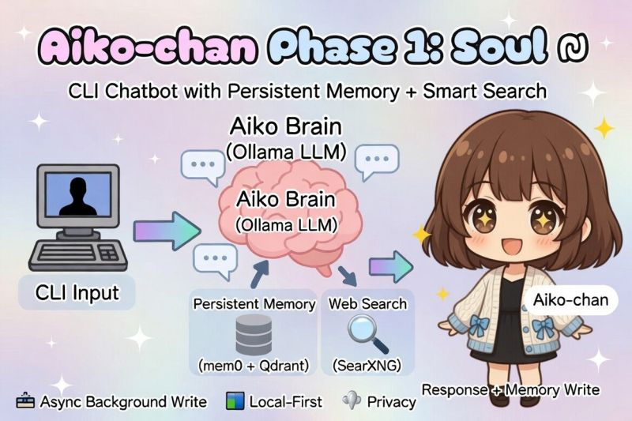
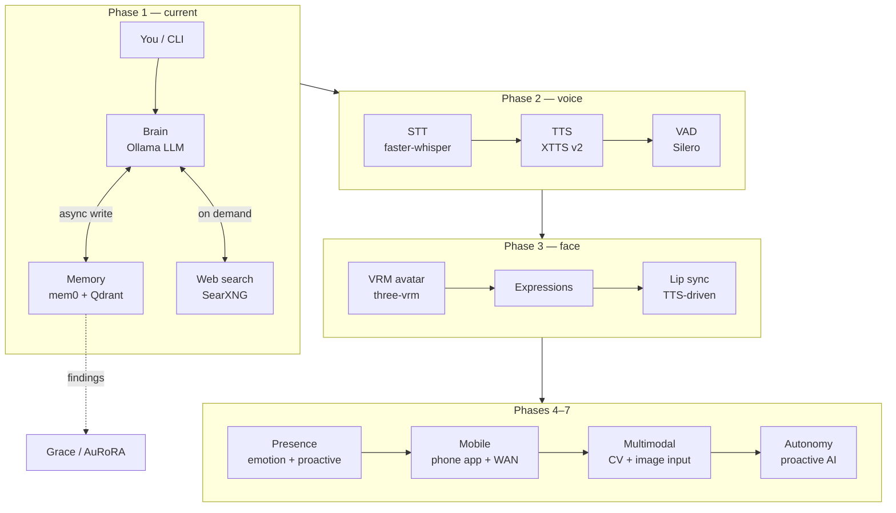

# Aiko-chan 愛子ちゃん

> AI companion, soulmate, and occasional roaster.
> A vibe-coded AI waifu built for real conversation, persistent memory, and eventually — a face and a voice.

This project is a **precursor and testing sandbox** for [Grace / AuRoRA](https://github.com/OppaAI/AGi).  
Core tech (mem0 + Qdrant memory, Ollama inference, async pipelines) is battle-tested here before graduating to Grace.



## Architecture




---

## Stack

| Layer | Tech |
|---|---|
| Brain | Ollama (remote or local LLM) |
| Long-term memory | mem0 + Qdrant (Docker) |
| Embeddings | Ollama (`nomic-embed-text-v2-moe`) |
| Web search | SearXNG (local, self-hosted) |
| Interface | CLI → Voice → Avatar → Mobile |

---

## Quickstart

### 1. Prerequisites

- [Ollama](https://ollama.com) running locally or on a remote server
- Docker + Docker Compose
- Python 3.10+
- [uv](https://github.com/astral-sh/uv)

```bash
ollama pull nomic-embed-text-v2-moe
```

### 2. Start Qdrant

```bash
docker compose up -d
```

Qdrant dashboard: http://localhost:6333/dashboard

### 3. Install dependencies

```bash
uv sync
```

### 4. Configure

```bash
cp .env.example .env
# edit .env — set your Ollama URL, model, SearXNG URL
```

### 5. Talk to Aiko-chan

```bash
uv run python cli.py

# with memory debug output each turn:
uv run python cli.py --debug

# wipe all stored memories:
uv run python cli.py --clear-mem
```

---

## CLI Commands

| Command | Action |
|---|---|
| `/quit` or `/exit` | End the session |
| `/reset` | Clear short-term context (long-term memory persists) |
| `/memory` | Print all stored memories (debug) |
| `/help` | Show command list |

---

## Project Structure

```text
aiko/
├── core/
│   ├── brain.py        # Ollama chat loop, search intercept, async memory
│   ├── memory.py       # mem0 + Qdrant wrapper
│   └── tools.py        # Web search via SearXNG
├── voice/
│   ├── stt.py          # Phase 2 — faster-whisper STT
│   └── tts.py          # Phase 2 — XTTS v2 TTS
├── avatar/
│   └── index.html      # Phase 3 — VRM avatar viewer
├── soul.md              # Aiko's soul and personality — edit freely
├── cli.py              # CLI entry point
├── docker-compose.yml  # Qdrant
├── project.toml        # uv dependencies
├── uv.lock             # uv dependencies
├── .env.example        # .env settings example
└── README.md           # This Readme
```

---

## Roadmap

# Roadmap

* [x] **Phase 1 — Soul**

  * CLI chatbot architecture.
  * Local inference via Ollama.
  * Persistent memory using mem0 + Qdrant.
  * Async memory writes.
  * Web search integration via SearXNG.

* [x] **Phase 1.5 — Stream**

  * Aiko-chan TUI CLI with cyberpunk ASCII interface.
  * Streaming inference architecture overhaul.
  * Decoupled LLM → TTS pipeline.
  * Callback-based response streaming.
  * Realtime speech synthesis.
  * Migration from Kokoro to PocketTTS.
  * Background LLM warmup to eliminate cold-start latency.
  * Background TTS warmup to eliminate cold-start latency.
  * Soul persona system (`persona/soul.md`).
  * Identity metadata and character framework.
  * Architectural renaming (`brain → think`, `memory → memorize`).
  * Non-blocking memory queue worker.
  * Removal of synchronous memory write bottlenecks.
  * CLI execution flow refactor.
  * Command-line argument parser redesign.
  * Audio streaming stability improvements.
  * Search output filtering and instruction refinement.
  * Jetson AI Lab dependency migration.

* [ ] **Phase 2 — Voice**

  * Microphone input via faster-whisper.
  * Push-to-talk mode.
  * Voice Activity Detection (VAD).
  * XTTS v2 anime voice profile.
  * Replace PocketTTS with XTTS v2.
  * Fully hands-free voice conversations on Jetson.

* [ ] **Phase 3 — Face**

  * VRM/VRoid avatar support.
  * Browser-based rendering via `@pixiv/three-vrm`.
  * Expression system:

    * Idle
    * Happy
    * Annoyed
    * Flustered
    * Thinking
  * Lip-sync driven by generated speech audio.
  * WebSocket bridge between Python backend and browser frontend.
  * Real-time avatar interaction.

* [ ] **Phase 4 — Presence**

  * Persistent emotional state machine.
  * Mood tracking across conversations.
  * Long-term relationship progression.
  * Shared references and inside jokes.
  * Episodic memory recall.
  * Context-aware personality evolution.
  * Proactive messaging when inactive for extended periods.

* [ ] **Phase 5 — Mobile**

  * Mobile application.
  * React Native or Flutter frontend.
  * WAN access from anywhere.
  * Push notifications.
  * Voice-first user experience.
  * Avatar integration on mobile devices.

* [ ] **Phase 6 — Multimodal**

  * Camera and computer vision input.
  * Image understanding and discussion.
  * Visual context integration into conversations.
  * Webcam-based expression awareness.
  * User-shared image analysis.

* [ ] **Phase 7 — Autonomy**

  * Scheduled independent operation.
  * Background information gathering.
  * News and knowledge consumption.
  * Topic discovery and self-directed exploration.
  * Initiates conversations instead of only responding.
  * Develops persistent interests and opinions.
  * Optional social media presence.
  * Optional autonomous content posting.


---

## Memory Evaluation Criteria

Findings from Phase 1 testing (for Grace / AuRoRA adoption):

- [ ] Does memory feel coherent across sessions?
- [ ] Does retrieval surface the right memories (not just recency)?
- [ ] Is extraction quality stable across different LLMs?
- [ ] Does mem0 hallucinate memories from model confabulation?
- [ ] Is write latency acceptable with async threading?
- [ ] Is Qdrant stable under continuous writes on Jetson?

---

## Support
If you find this project useful, consider buying me a coffee ☕  
It helps keep the phases shipping.

[](https://ko-fi.com/oppaai)
