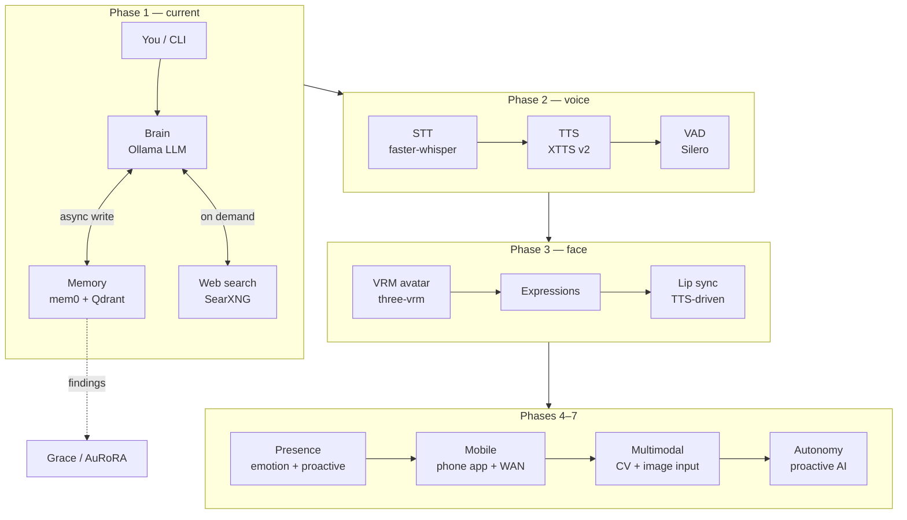

# Aiko-chan 愛子ちゃん

> AI companion, soulmate, and occasional roaster.
> A vibe-coded AI waifu built for real conversation, persistent memory, and eventually — a face and a voice.

This project is a **precursor and testing sandbox** for [Grace / AuRoRA](https://github.com/OppaAI/AGi).  
Core tech (mem0 + Qdrant memory, Ollama inference, async pipelines) is battle-tested here before graduating to Grace.

## Architecture




---

## Stack

| Layer | Tech |
|---|---|
| Brain | Ollama (remote or local LLM) |
| Long-term memory | mem0 + Qdrant (Docker) |
| Embeddings | Ollama (`nomic-embed-text-v2-moe`) |
| Web search | SearXNG (local, self-hosted) |
| Interface | CLI → Voice → Avatar → Mobile |

---

## Quickstart

### 1. Prerequisites

- [Ollama](https://ollama.com) running locally or on a remote server
- Docker + Docker Compose
- Python 3.10+
- [uv](https://github.com/astral-sh/uv)

```bash
ollama pull nomic-embed-text-v2-moe
```

### 2. Start Qdrant

```bash
docker compose up -d
```

Qdrant dashboard: http://localhost:6333/dashboard

### 3. Install dependencies

```bash
uv sync
```

### 4. Configure

```bash
cp .env.example .env
# edit .env — set your Ollama URL, model, SearXNG URL
```

### 5. Talk to Aiko-chan

```bash
uv run python cli.py

# with memory debug output each turn:
uv run python cli.py --debug

# wipe all stored memories:
uv run python cli.py --clear-mem
```

---

## CLI Commands

| Command | Action |
|---|---|
| `/quit` or `/exit` | End the session |
| `/reset` | Clear short-term context (long-term memory persists) |
| `/memory` | Print all stored memories (debug) |
| `/help` | Show command list |

---

## Project Structure

```text
aiko/
├── core/
│   ├── brain.py        # Ollama chat loop, search intercept, async memory
│   ├── memory.py       # mem0 + Qdrant wrapper
│   └── tools.py        # Web search via SearXNG
├── voice/
│   ├── stt.py          # Phase 2 — faster-whisper STT
│   └── tts.py          # Phase 2 — XTTS v2 TTS
├── avatar/
│   └── index.html      # Phase 3 — VRM avatar viewer
├── soul.md              # Aiko's soul and personality — edit freely
├── cli.py              # CLI entry point
├── docker-compose.yml  # Qdrant
├── project.toml        # uv dependencies
├── uv.lock             # uv dependencies
├── .env.example        # .env settings example
└── README.md           # This Readme
```

---

## Roadmap

- [x] **Phase 1 — Soul**
  CLI chatbot with persistent memory (mem0 + Qdrant + Ollama).
  Async memory writes. Web search via SearXNG.
  - [ ] Replace per-turn `thread.join()` with a dedicated worker + queue for truly non-blocking memory writes.

- [ ] **Phase 2 — Voice**
  faster-whisper STT for mic input.
  XTTS v2 TTS with anime voice profile.
  Push-to-talk or VAD (voice activity detection).
  Fully hands-free conversation on Jetson.

- [ ] **Phase 3 — Face**
  VRM/VRoid 3D avatar rendered in browser via `@pixiv/three-vrm`.
  Expression states: idle, happy, annoyed, flustered, thinking.
  Lip sync driven by TTS audio output.
  WebSocket bridge: Python backend → browser frontend.

- [ ] **Phase 4 — Presence**
  Emotion state machine — Aiko tracks mood across the conversation.
  Proactive messages — she reaches out when she hasn't heard from you.
  Long-term relationship progression — her tone evolves over time.
  Deeper memory: episodic recall, shared references, inside jokes.

- [ ] **Phase 5 — Mobile**
  React Native or Flutter app.
  WAN access — talk to Aiko from anywhere via phone.
  Push notifications for proactive messages.
  Voice-first UI with avatar.

- [ ] **Phase 6 — Multimodal**
  Camera / CV input — she can see what you share with her.
  Image understanding: "what do you think of this?" with photo.
  Optional: she reacts to your expressions via webcam.

- [ ] **Phase 7 — Autonomy**
  Aiko runs on a schedule independently.
  Reads news, learns new things, forms opinions.
  Brings topics *to* you instead of only reacting.
  Optional: social media presence, posts on your behalf.

---

## Memory Evaluation Criteria

Findings from Phase 1 testing (for Grace / AuRoRA adoption):

- [ ] Does memory feel coherent across sessions?
- [ ] Does retrieval surface the right memories (not just recency)?
- [ ] Is extraction quality stable across different LLMs?
- [ ] Does mem0 hallucinate memories from model confabulation?
- [ ] Is write latency acceptable with async threading?
- [ ] Is Qdrant stable under continuous writes on Jetson?

---

## Support
If you find this project useful, consider buying me a coffee ☕  
It helps keep the phases shipping.
