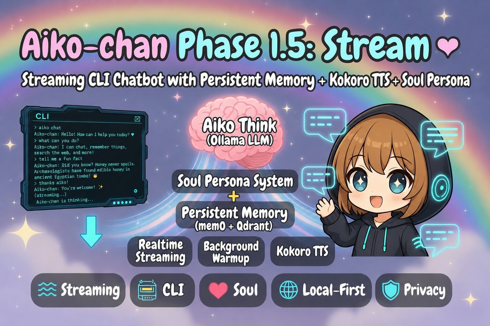
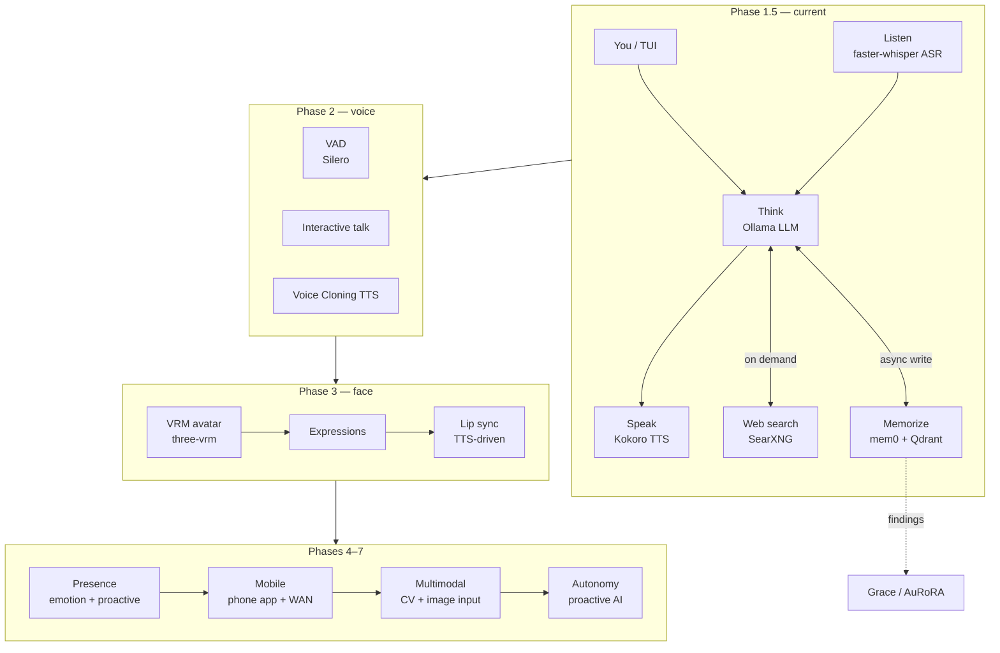

# Aiko-chan 愛子ちゃん

> Aiko is an AI waifu, soulmate, companion and occasional roaster, in which ai (love-愛) and AI mixes together?!
> 
> Runs fully local on 8GB VRAM GPU (or Jetson Orin Nano). No cloud. No subscriptions. Just vibes.

## Purposes
This project serves the following purposes:
- operates an AI companion chatbot with memory, some agentic tool calls, TTS, ASR, vision, etc. in all local environment, except using Internet for websearch or remote access
- stress tests all the AI inference and functionalities in measely 8GB RAM system. (for those who cannot afford a decent GPU - me)
- acts as a **precursor and testing sandbox** for my more sophisticated project: [Grace / AuRoRA](https://github.com/OppaAI/AGi).
- participates in HuggingFace hackathon, if managed to finish on time...



## Architecture



---

## Stack

| Layer | Tech |
|---|---|
| Brain | Ollama (remote or local LLM) |
| Long-term memory | mem0 + Qdrant (Docker) |
| Embeddings | Ollama (`nomic-embed-text-v2-moe`) |
| Web search | SearXNG (local, self-hosted) |
| TTS | Kokoro (via RealtimeTTS) |
| ASR | faster-whisper |
| Interface | TUI → Voice → Avatar → Mobile |

---

## Quickstart

### 1. Prerequisites

- [Ollama](https://ollama.com) running locally or on a remote server
- Docker + Docker Compose
- GPU with **8GB VRAM** (developed on NVIDIA Jetson Orin Nano; any 8GB GPU should work)
- Python **3.10 exactly** (3.11+ not supported — Jetson AI Lab wheels are 3.10-only)
- [uv](https://github.com/astral-sh/uv)

```bash
ollama pull nomic-embed-text-v2-moe
```

### 2. Start Qdrant + SearXNG (Docker containers)
> **SearXNG config:** The `./searxng/` directory must contain a `settings.yml`
> before starting. A minimal template is included in the repo.
> `SEARXNG_BASE_URL` is used internally by the container to generate links.
> `SEARXNG_URL` in your `.env` is what Aiko uses to call the search API —
> it must match the host port mapping (`http://localhost:8081`).

```bash
docker compose up -d
```

Qdrant dashboard: http://localhost:6333/dashboard

### 3. Install dependencies

```bash
uv sync
```

### 4. Configure

```bash
cp .env.example .env
# edit .env — set your Ollama URL, model, SearXNG URL, Kokoro voice
```

### 5. Talk to Aiko-chan

```bash
# Full voice mode — ASR input + TTS output
uv run python cli.py

# Text mode — keyboard input, no TTS
uv run python cli.py --text

# Show memory debug output each turn
uv run python cli.py --debug

# Wipe all stored memories and exit
uv run python cli.py --clear-mem
```

---

## CLI Commands

| Command | Action |
|---|---|
| `/quit` or `/exit` | End the session |
| `/reset` | Clear short-term context (long-term memory persists) |
| `/memory` | Print all stored memories |
| `/clear` | Wipe all long-term memories from the database |
| `/web <query>` | Run a web search and ask Aiko about the results |
| `/voice` | Toggle TTS on/off at runtime |
| `/listen` | Toggle ASR on/off at runtime (falls back to keyboard) |
| `/help` | Show command list |

---

## Project Structure

```text
aiko/
├── core/
│   ├── think.py        # Ollama chat loop, streaming, search intercept, warmup
│   ├── memorize.py     # mem0 + Qdrant wrapper, async queue worker
│   ├── speak.py        # Kokoro TTS pipeline, background warmup
│   ├── listen.py       # faster-whisper ASR, VAD, status callbacks
│   ├── tools.py        # Web search via SearXNG
│   └── silence.py      # Stderr suppression utility
├── persona/
│   ├── soul.md         # Aiko's personality, rules, and voice — edit freely
│   └── identity.md     # Banner text, ASCII art, and color map for TUI
├── cli.py              # Curses TUI entry point
├── docker-compose.yml  # Qdrant
├── pyproject.toml      # uv dependencies
├── uv.lock             # uv lockfile
├── .env.example        # Environment variable reference
└── README.md           # This file
```

---

## Roadmap

* [x] **Phase 1 — Soul**

  * CLI chatbot architecture.
  * Local inference via Ollama.
  * Persistent memory using mem0 + Qdrant.
  * Async memory writes.
  * Web search integration via SearXNG.

* [x] **Phase 1.5 — Stream**

  * Aiko-chan TUI CLI with cyberpunk ASCII interface.
  * Streaming inference architecture overhaul.
  * Decoupled LLM → TTS pipeline.
  * Callback-based response streaming.
  * Realtime speech synthesis via Kokoro.
  * Background LLM warmup to eliminate cold-start latency.
  * Background TTS warmup to eliminate cold-start latency.
  * Soul persona system (`persona/soul.md`).
  * Identity metadata and character framework (`persona/identity.md`).
  * Architectural renaming (`brain → think`, `memory → memorize`).
  * Non-blocking memory queue worker.
  * Removal of synchronous memory write bottlenecks.
  * CLI execution flow refactor.
  * Command-line argument parser redesign.
  * Audio streaming stability improvements.
  * Search output filtering and instruction refinement.
  * Jetson AI Lab dependency migration.

* [ ] **Phase 2 — Voice**

  * Microphone input via faster-whisper.
  * Interactive Talk mode.
  * Voice Activity Detection (VAD).
  * Fully hands-free voice conversations on Jetson.
  * TTS voice cloning exploration and integration (eg. XTTS, PocketTTS)

* [ ] **Phase 3 — Face**

  * VRM/VRoid avatar support.
  * Browser-based rendering via `@pixiv/three-vrm`.
  * Expression system (idle, happy, annoyed, flustered, thinking).
  * Lip-sync driven by generated speech audio.
  * WebSocket bridge between Python backend and browser frontend.
  * Real-time avatar interaction.

* [ ] **Phase 4 — Presence**

  * Persistent emotional state machine.
  * Mood tracking across conversations.
  * Long-term relationship progression.
  * Shared references and inside jokes.
  * Episodic memory recall.
  * Context-aware personality evolution.
  * Proactive messaging when inactive for extended periods.

* [ ] **Phase 5 — Mobile**

  * Mobile application (React Native or Flutter).
  * WAN access from anywhere.
  * Push notifications.
  * Voice-first user experience.
  * Avatar integration on mobile.

* [ ] **Phase 6 — Multimodal**

  * Camera and computer vision input.
  * Image understanding and discussion.
  * Visual context integration into conversations.
  * Webcam-based expression awareness.
  * User-shared image analysis.

* [ ] **Phase 7 — Autonomy**

  * Scheduled independent operation.
  * Background information gathering.
  * Topic discovery and self-directed exploration.
  * Initiates conversations instead of only responding.
  * Develops persistent interests and opinions.
  * Optional social media presence and autonomous content posting.

---

## Memory Evaluation Criteria

Findings from Phase 1 testing (for Grace / AuRoRA adoption):

- [ ] Does memory feel coherent across sessions?
- [ ] Does retrieval surface the right memories (not just recency)?
- [ ] Is extraction quality stable across different LLMs?
- [ ] Does mem0 hallucinate memories from model confabulation?
- [ ] Is write latency acceptable with async threading?
- [ ] Is Qdrant stable under continuous writes on Jetson?

---

## Support
If you find this project useful, consider buying me a coffee ☕  
It helps keep the phases shipping.

[](https://ko-fi.com/oppaai)
