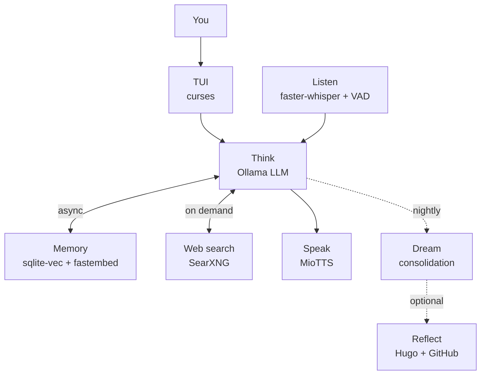

# Aiko-chan 愛子ちゃん

> A local-first AI companion with a curses TUI, persistent memory, web search, microphone input, and MioTTS voice output.
> Optimised for constrained hardware — runs on a Jetson Orin Nano with 8 GB VRAM.

**Author:** [OppaAI](https://github.com/OppaAI) · Beautiful British Columbia, Canada
 
[](https://github.com/OppaAI/Aiko-chan)
[](https://opensource.org/licenses/Apache-2.0)


 


---

## Purpose
This project currently serves as:

- a local AI companion chatbot with persistent memory, web search, TTS, ASR, and a terminal UI;
- a stress test for running a full conversational stack on constrained hardware such as an 8 GB VRAM GPU or Jetson Orin Nano;
- a precursor and testing sandbox for the larger Grace / AuRoRA project;
- an experimental playground for memory decay, nightly consolidation, and daily reflection publishing.

---

## Documentation

| Document | Description |
|---|---|
| [docs/INSTALL.md](docs/INSTALL.md) | Step-by-step installation for every component |
| [docs/HISTORY.md](docs/HISTORY.md) | How Aiko evolved from a chatbot into a companion |
| [docs/ROADMAP.md](docs/ROADMAP.md) | Detailed phase-by-phase feature roadmap |
| [docs/TESTS.md](docs/TESTS.md) | Manual smoke-test checklist for each phase |

---

## Architecture



---

## Stack

| Layer | Implementation |
|---|---|
| Entry point | `main.py` |
| Interface | full-screen curses TUI in `tui/` |
| Chat model | Ollama via `ollama.Client` |
| Long-term memory | custom sqlite-vec backend (no server required) |
| Embeddings | fastembed `BAAI/bge-base-en-v1.5` |
| Memory lifecycle | Ebbinghaus-style decay, pinned memories, nightly `dream()` consolidation |
| Web search | local SearXNG instance |
| TTS | external MioTTS HTTP server |
| ASR | faster-whisper with Silero VAD |
| Reflection publishing | optional GitHub REST API + Hugo markdown |

---

## Quickstart

**Prerequisites:** Python 3.12, [uv](https://astral.sh/uv), CUDA 12.6, Docker + Compose, [Ollama](https://ollama.com), a pulled chat model (7B+ recommended).

> Full installation walkthrough → **[docs/INSTALL.md](docs/INSTALL.md)**

```bash
git clone https://github.com/OppaAI/Aiko-chan.git
cd Aiko-chan
cp .env.example .env        # edit: OLLAMA_MODEL, SQLITE_MEMORY_PATH, SEARXNG_URL, MIOTTS_API_URL
docker compose up -d
uv sync
uv run python main.py
```

```bash
uv run python main.py --text      # keyboard input, no ASR/TTS
uv run python main.py --debug     # show memory hits each turn
uv run python main.py --clear-mem # wipe all memories and exit
```

---

## In-App Commands

| Command | Action |
|---|---|
| `/quit` or `/exit` | End the session |
| `/reset` | Clear short-term context; long-term memory persists |
| `/memory` | Print all stored memories |
| `/clear` | Wipe all long-term memories |
| `/remember` | Pin the last exchange — decay-proof |
| `/think <question>` | Higher-token reasoning turn; suppresses `<think>` scratchpad |
| `/web <query>` | SearXNG search → grounded answer |
| `/voice` | Toggle TTS on/off |
| `/listen` | Toggle ASR on/off |
| `/help` | Show the command list |

---

## Project Structure

```text
Aiko-chan/
├── main.py
├── core/
│   ├── think.py         # Ollama chat loop, streaming, web-search trigger
│   ├── memorize.py      # sqlite-vec backend, pinned memories, decay
│   ├── forget.py        # decay scoring and cleanup gates
│   ├── dream.py         # midnight consolidation scheduler
│   ├── reflect.py       # Hugo/GitHub reflection publisher
│   ├── speak.py         # MioTTS HTTP client
│   ├── listen.py        # faster-whisper + Silero VAD
│   ├── tools.py         # SearXNG helper
│   ├── health.py        # TUI vitals
│   ├── log.py           # rotating log setup
│   └── silence.py       # stderr suppression
├── tui/
│   ├── tui.py
│   └── identity.py
├── persona/
│   ├── soul.md          # personality, rules, and voice
│   └── identity.md      # banner and ASCII art
├── searxng/
│   ├── settings.yml
│   └── limiter.toml
├── docs/
│   ├── INSTALL.md
│   ├── TESTS.md
│   └── ROADMAP.md
├── assets/
├── docker-compose.yml
├── pyproject.toml
├── uv.lock
├── .env.example
└── README.md
```

---

## Roadmap

| Phase | Name | Status |
|---|---|---|
| 1 | Soul — CLI, Ollama, mem0 + Qdrant, SearXNG | ✅ Done |
| 1.5 | Stream — curses TUI, streaming pipeline, MioTTS, persona | ✅ Done |
| 2 | Voice — faster-whisper ASR, Silero VAD, hands-free talk | 🔲 Next |
| 3 | Face — VRM avatar, three-vrm, expressions, lip-sync | 🔲 Planned |
| 4 | Presence — emotional state, mood, relationship progression | 🔲 Planned |
| 5 | Mobile — React Native / Flutter, WAN, push notifications | 🔲 Planned |
| 6 | Multimodal — camera, vision input, webcam expression awareness | 🔲 Planned |
| 7 | Autonomy — scheduled operation, self-directed exploration | 🔲 Planned |

Full details → **[docs/ROADMAP.md](docs/ROADMAP.md)**

---

## Notes

- Memory uses a custom sqlite-vec backend — no Qdrant server or mem0 required. Qdrant + mem0 were dropped in Phase 2 due to OOM issues on the Jetson Orin Nano.
- Entry point is `main.py`, not `cli.py` anymore.
- TTS runtime is using MioTTS server. Kokoro/RealtimeTTS remnants is dropped due to OOM and quality issues.
- Reflection publishing fails safely if `GITHUB_TOKEN` or `GITHUB_REPO` are missing.

---

## Support

If you find this project useful, consider buying me a coffee ☕

[](https://ko-fi.com/oppaai)
