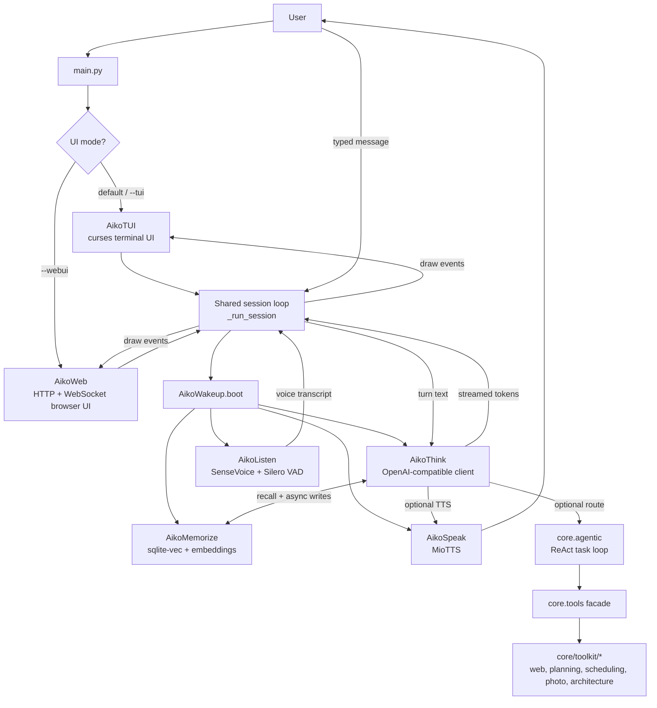
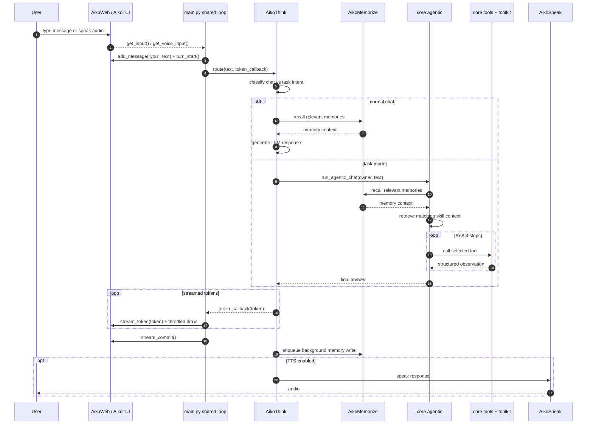
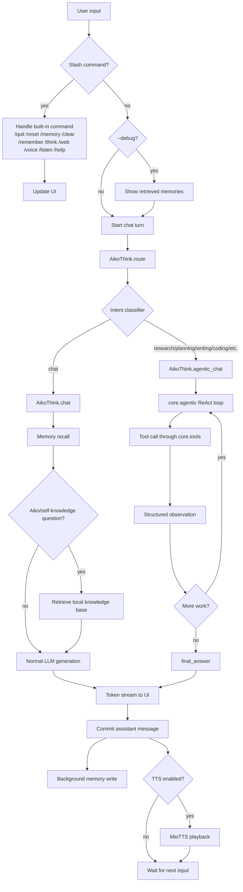
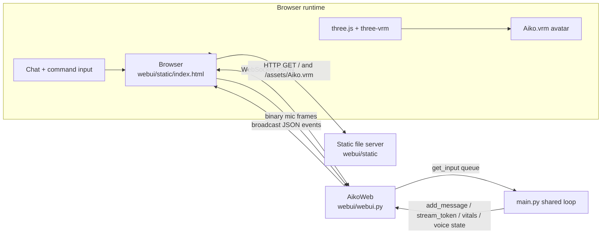
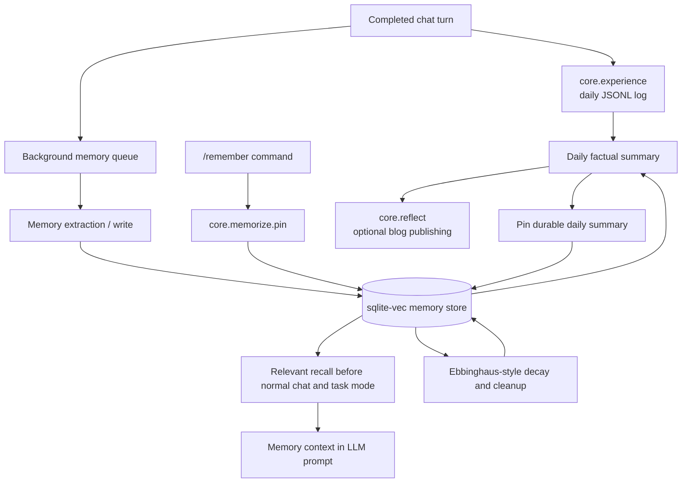
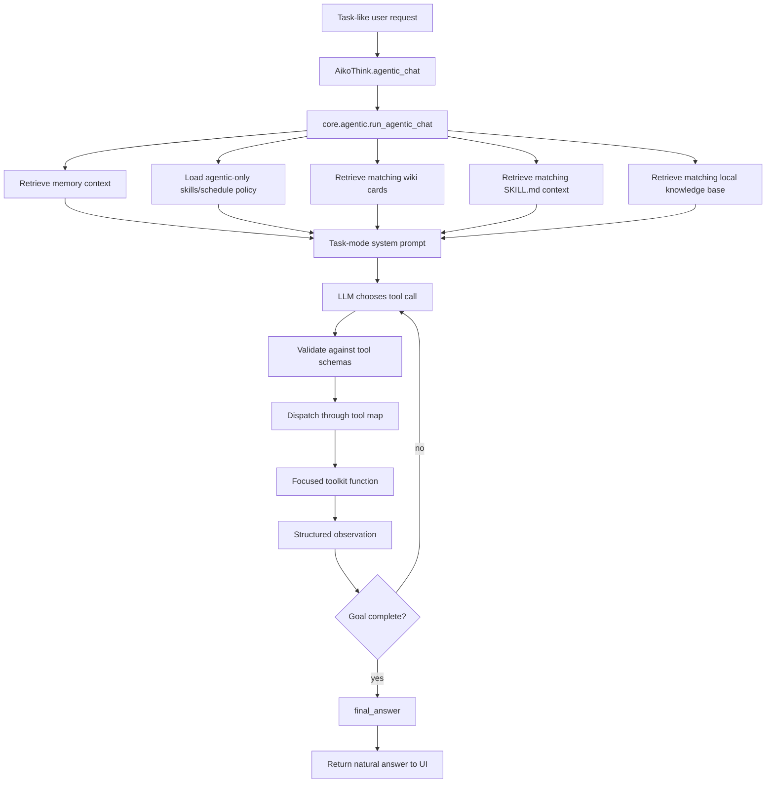

# Aiko Runtime Architecture

## Current Split

Aiko's runtime is already partly separated:

- `main.py` is the launch orchestrator. It selects the curses TUI by default, keeps the browser WebUI behind `--webui`, boots the subsystems through `AikoWakeup`, and then runs the shared input → route → render loop.
- `webui/webui.py` is the browser UI adapter. It serves `webui/static/`, opens a WebSocket bridge, accepts browser mic-audio frames, broadcasts chat/vitals/voice/expression/viseme events, and implements the same draw/input methods as the curses TUI.
- `tui/tui.py` is the legacy full-screen curses adapter. It implements the same UI contract used by the shared session loop.
- `core/wakeup.py` owns parallel subsystem startup and returns a `BootResult` containing live references to thinking, memory, speech, and listening modules.
- `core/tools.py` is the compatibility facade for pure callable tools and should stay as the stable import surface; focused implementations live under `core/toolkit/` (web, planning, scheduling, photo, architecture). These functions do not own the ReAct loop.
- `core/think.py` owns the public chat facade: OpenAI-compatible LLM client setup, semantic/LLM routing, normal chat, TTS/history glue, scheduled job callbacks, idle learner handoff, and background memory writes.
- `core/agentic.py` owns task-mode tool schemas, ReAct loop execution, and tool dispatch.
- `core/skills.py` owns local skill document CRUD/search helpers and the `skills/<skill_id>/SKILL.md` registry used by task mode.
- `core/memorize.py` owns persistent memory CRUD, recall, pinning, decay, cleanup, and nightly consolidation.
- `core/experience.py` owns the daily JSONL chat-turn log used by factual daily summaries.
- `core/reflect.py` owns factual daily summary generation, blog publishing, and pinning the generated daily summary.

## Module Boundaries

The runtime split should stay close to this shape:

```text
main.py            CLI flags, default curses UI selection, optional WebUI selection, shared session loop
webui/webui.py  browser adapter: HTTP static server, WebSocket bridge, UI API
tui/tui.py         curses adapter implementing the same UI API
core/wakeup.py     boot orchestration and BootResult assembly
core/tools.py      compatibility facade for pure callables
core/toolkit/      focused tool implementations, no LLM loop, no conversational state
core/agentic.py    ReAct loop, tool schemas, tool dispatch
core/skills.py     skill CRUD and retrieval: load, append, prune, search, skill registry
skills/<id>/       human-readable repeatable workflow documents
core/think.py      public chat facade: OpenAI-compatible LLM calls, normal chat, agentic handoff, TTS/history glue
```

Keep memory separate from all three: `core/memorize.py` should remain the single owner of persistent memory, including `pin()`.

## High-Level Runtime Flow



## Boot Sequence

```mermaid
sequenceDiagram
    autonumber
    participant User
    participant Main as main.py
    participant UI as AikoWeb or AikoTUI
    participant Wakeup as core.wakeup.AikoWakeup
    participant Think as core.think.AikoThink
    participant Memory as core.memorize.AikoMemorize
    participant Speak as core.speak.AikoSpeak
    participant Listen as core.listen.AikoListen

    User->>Main: python main.py [--tui|--webui|--text|--no-asr]
    Main->>UI: construct selected UI adapter (curses by default, browser with --webui)
    Main->>UI: start init spin loop
    Main->>Wakeup: boot(on_loading, on_done, on_skip)
    par Parallel cognitive boot
        Wakeup->>Think: construct + warm model/client cache
        Think-->>Wakeup: ready
    and Parallel memory boot
        Wakeup->>Memory: open sqlite-vec + embedding backend
        Memory-->>Wakeup: ready
    end
    Wakeup->>Think: inject Memory reference
    Wakeup->>Speak: warm TTS client
    Speak-->>Wakeup: ready
    Wakeup->>Listen: initialize ASR + VAD + barge-in monitor
    Listen-->>Wakeup: ready
    Wakeup-->>Main: BootResult(think, memorize, speak, listen)
    Note over Main: --text/--no-asr only change initial toggles; /voice and /listen can enable loaded subsystems.
    Main->>UI: status_finish + first draw
    Main->>Main: enter shared input loop
```

## Conversation Turn Sequence



## Routing and Execution Flow



## WebUI Data Flow



## Memory Lifecycle Flow



## Knowledge Governance

- Wiki cards and skill workflow files are treated as trusted local knowledge only when they include required front matter.
- Run `python -m kb.lint` after changing `wiki/*.md` or `skills/*/SKILL.md`.
- Aiko should draft proposed knowledge updates under `workspace/kb_proposals/` instead of silently rewriting trusted wiki or skill policy.

## Agentic Task Flow



## Current Runtime Configuration

- `LLM_BASE_URL` and `LLM_MODEL` select the local OpenAI-compatible LLM endpoint. The current code no longer imports `ollama.Client` for chat.
- `EMBED_MODEL`, `EMBED_DIMS`, `EMBED_CACHE_PATH`, and `SQLITE_MEMORY_PATH` configure local sqlite-vec memory and the custom Harrier ONNX embedder. `FASTEMBED_CACHE_PATH` is only a backward-compatible cache fallback for older env files.
- `ROUTE_ENABLED`/`ROUTE_MODE`/`ROUTE_SEMANTIC_THRESHOLD` are the environment variables read by `core/think.py`; older `AIKO_ROUTE_*` names in stale env files should be migrated.
- `MIOTTS_API_URL`, `MIOTTS_PRESET`, and `MIOTTS_DEVICE` configure voice output.
- `ASR_*`, `LISTEN_*`, and `SPEAKER_*` configure SenseVoice, Silero VAD, optional speaker verification, and barge-in.
- `WORKSPACE_ROOT`, `SCHEDULE_PATH`, and `SCHEDULE_POLL_SECONDS` configure local scheduled work/reminders.

## Memory Use Rules

- Normal chat should retrieve relevant memories before generation.
- Task mode should also retrieve relevant memories before tool choice, so tools and final answers can use user preferences and prior context.
- Tool functions should not read memory directly. The agent loop should retrieve memory and pass relevant context into the LLM.
- Daily summaries should use both the daily chat-turn log and persistent memory snippets, then pin the factual summary as permanent memory.
- Daily summaries should preserve important facts such as dates, deadlines, commitments, projects, events, losses, incidents, and goals. Mundane details should be downweighted unless they imply a pattern, risk, or follow-up.
