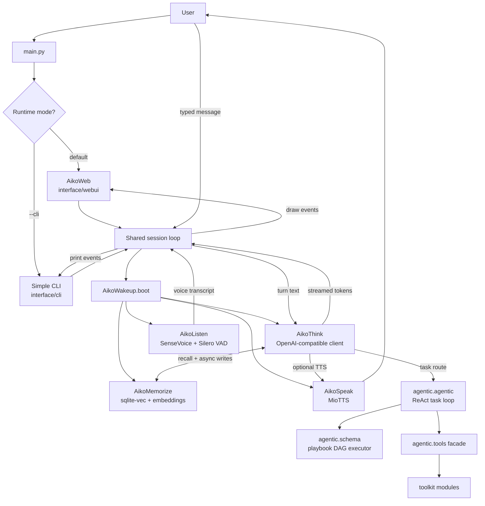
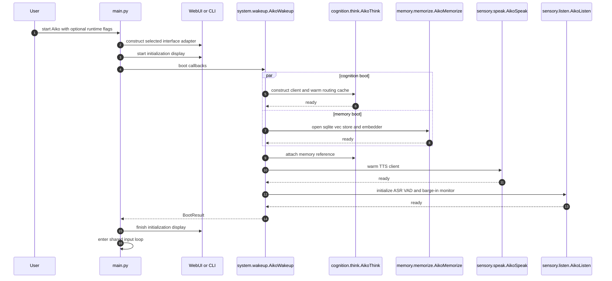
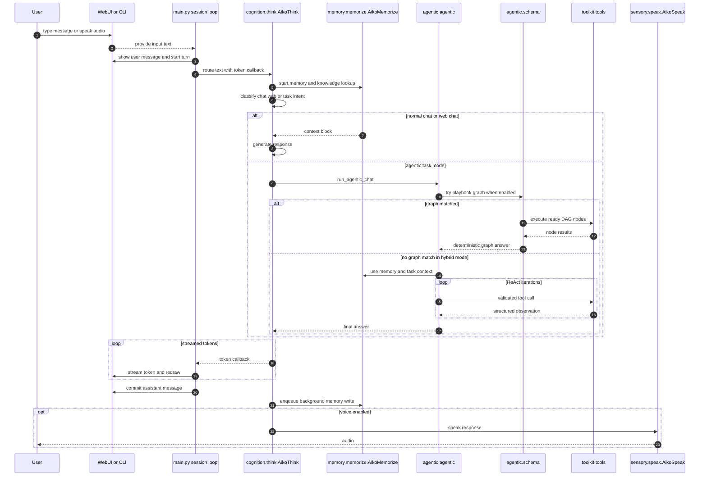
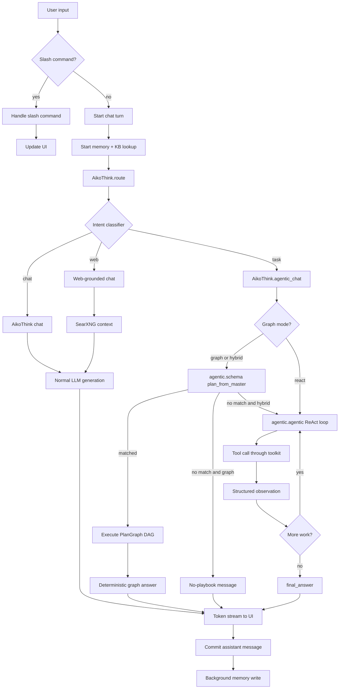
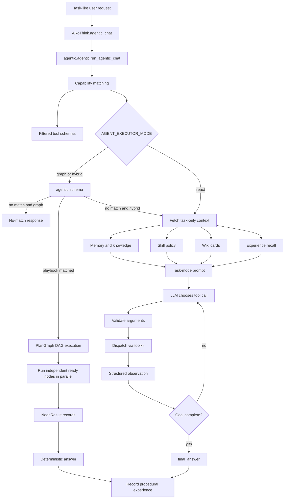

# Aiko Runtime Architecture

## Current Split

Aiko is organized by runtime responsibility rather than by one monolithic `core/` package:

- `main.py` is the launch orchestrator. The browser WebUI is the default UI; `--cli` runs a simple local CLI for testing.
- `interface/webui/webui.py` serves the browser frontend, owns the WebSocket bridge, accepts browser microphone frames, and broadcasts chat, vitals, voice, expression, and viseme events.
- `interface/cli/` contains authentication and helper code for the simple CLI path.
- `system/wakeup.py` owns parallel subsystem startup and returns a `BootResult` containing thinking, memory, speech, and listening modules.
- `cognition/think.py` owns the public chat facade: OpenAI-compatible LLM setup, semantic/LLM routing, normal chat, TTS/history glue, scheduled job callbacks, idle learner handoff, and background memory writes.
- `agentic/agentic.py` owns task-mode tool schemas, ReAct loop execution, final-answer verification, and tool dispatch.
- `agentic/schema.py` owns the graph-first playbook DAG executor.
- `agentic/tools.py` is the compatibility facade for executable tools; focused implementations live under `agentic/toolkit/`.
- `agentic/skills.py` owns skillset CRUD/search helpers and the `agentic/skillsets/` workflow registry used by task mode.
- `memory/memorize.py` owns persistent memory CRUD, recall, pinning, decay, cleanup, and consolidation hooks.
- `memory/reflect.py` owns factual daily summary publishing and pinning of generated daily summaries.

## Module Boundaries

```text
main.py               CLI flags, WebUI default launch, simple CLI option, shared session loop
interface/webui/      browser adapter, HTTP static server, WebSocket bridge, UI API
interface/cli/        CLI auth and local testing helpers
system/wakeup.py      boot orchestration and BootResult assembly
cognition/think.py    chat facade, routing, scheduled callbacks, TTS/history glue
memory/               memory, journal, consolidation, reflection, sqlite-vec helpers
sensory/              speech and listening adapters
agentic/tools.py      stable facade for pure callable tools
agentic/toolkit/              focused tool implementations; no LLM loop or conversation state
agentic/agentic.py     ReAct loop, tool schemas, dispatch, verification, experience recording
agentic/schema.py      graph-first playbook DAG executor
agentic/skillsets/     human-readable repeatable workflow documents
wiki/                 trusted local knowledge cards
```

Memory stays separate from chat routing, tool execution, and UI rendering. Tool functions should not read memory directly; the chat/agent layer retrieves memory and passes relevant context into prompts or tool arguments.

## High-Level Runtime Flow



## Boot Sequence

The second Mermaid diagram is intentionally conservative: it avoids characters that older Mermaid sequence parsers often misread inside message labels.



## Conversation Turn Sequence



## Routing and Execution Flow



## Agentic Task Flow



## Autonomous Sub-Agent Status

Aiko can already run **autonomous graph nodes inside one orchestrated agentic turn**: `agentic.schema.execute_graph` finds nodes whose dependencies are satisfied, runs independent ready nodes through a thread pool, marks nodes with failed dependencies as `dependency_failed`, and records the resulting trace. That is useful for deterministic playbook workflows.

Aiko does **not** yet have a fully independent, long-running autonomous sub-agent runtime. A true sub-agent layer would add durable queues, leases or heartbeats, cancellation, per-agent workspace/artifact boundaries, retry policy, permissions, and observability. The current architecture is compatible with that future layer because graph nodes are already explicit units of work, but today they are lightweight in-process tool tasks rather than separately managed workers.

## Current Runtime Configuration

- `LLM_BASE_URL` and `LLM_MODEL` select the local OpenAI-compatible LLM endpoint.
- `EMBED_MODEL`, `EMBED_DIMS`, `EMBED_CACHE_PATH`, and `SQLITE_MEMORY_PATH` configure local sqlite-vec memory and the Harrier ONNX embedder.
- `ROUTE_ENABLED`, `ROUTE_MODE`, and route thresholds are read by `cognition/think.py`.
- `AGENT_EXECUTOR_MODE` selects `graph`, `hybrid`, or `react` task execution.
- `GRAPH_playbook_PATH` and `GRAPH_MAX_WORKERS` configure `agentic.schema`.
- `ROUTE_VECTOR_CACHE_ENABLED` enables safe `.npz` route-vector cache files.
- `MIOTTS_API_URL`, `MIOTTS_PRESET`, and `MIOTTS_DEVICE` configure voice output.
- `ASR_*`, `LISTEN_*`, and `SPEAKER_*` configure SenseVoice, Silero VAD, speaker verification, and barge-in.
- `WORKSPACE_ROOT`, `SCHEDULE_PATH`, and `SCHEDULE_POLL_SECONDS` configure local workspace and scheduled work.

## Knowledge Governance

- Wiki cards and skill workflow files are treated as trusted local knowledge only when they include required front matter.
- Run `python -m util.lint` after changing `wiki/*.md` or `agentic/skillsets/*.md` where applicable.
- Aiko should draft proposed knowledge updates under `workspace/kb_proposals/` instead of silently rewriting trusted wiki or skill policy.

## Semantic Vector Cache

Intent-routing examples are authored as text in `cognition/router_prompts.json`, but their embedding matrix can be cached on disk with `ROUTE_VECTOR_CACHE_ENABLED=1`. The cache is keyed by the examples, instruct string, embedding backend metadata, and `EMBED_DIMS`, and is stored as a NumPy `.npz` archive loaded with `allow_pickle=False`.

Graph playbooks are currently matched by trigger and capability metadata, so there are no graph vectors to precompute yet. If graph matching becomes semantic, the same pattern should be used: stable JSON/YAML plan specs as the source of truth, plus generated vector-cache artifacts that are safe to delete and rebuild.
