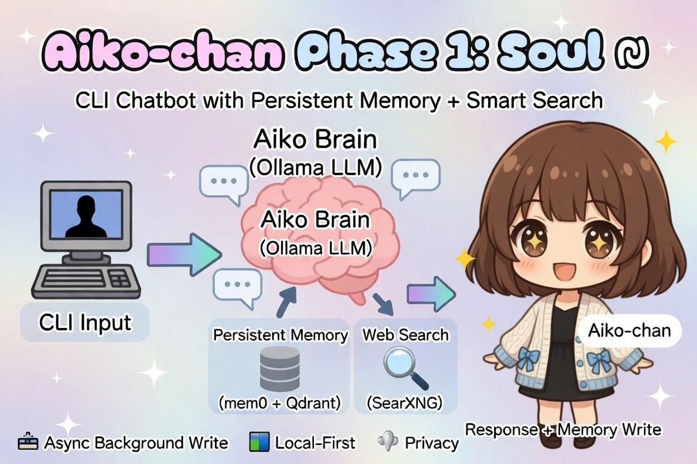
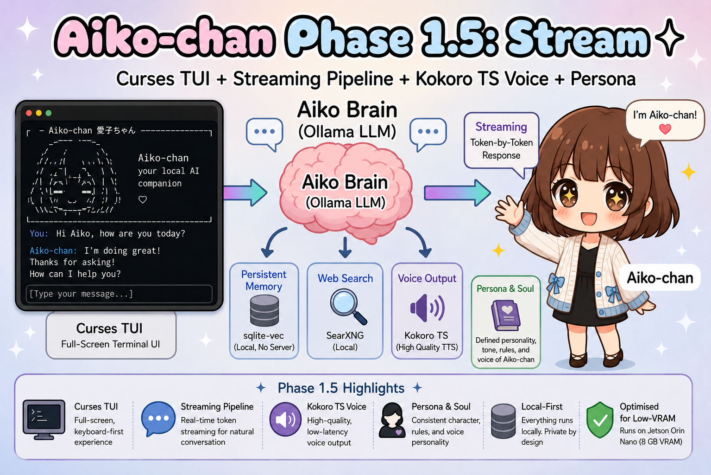
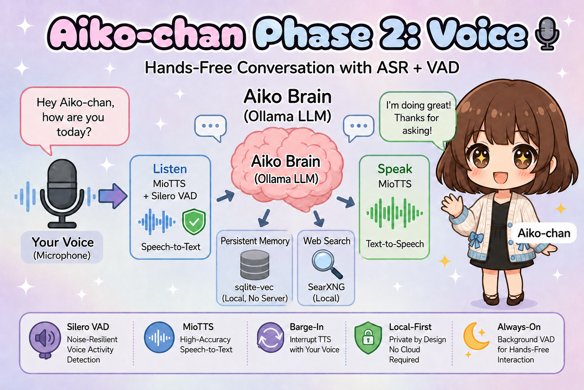
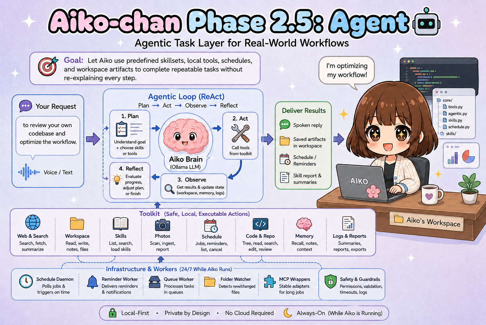

# Aiko-chan 愛子ちゃん — Development History

Aiko-chan did not begin as a polished AI companion.

It began as a simple question:

> How much of a complete AI companion can run locally on an 8 GB Jetson Orin Nano?

The project became an experiment in balancing capability, personality, privacy, and hardware limitations while remaining entirely local-first.

This document records the major architectural decisions, successes, failures, rewrites, and lessons learned throughout development.

---

# Before Phase 1

The original concept was much smaller.

The first goal was simply to create a local chatbot that could:

- run through Ollama
- remember previous conversations
- search the web when necessary
- avoid any cloud dependency

At the time, the architecture was intentionally simple.

Conversations started feeling less like interactions with a model and more like interactions with a character.

That observation shaped every phase that followed.

---

# Phase 1 — Soul

Goal:

> Prove that a local AI companion with memory and web search is viable on constrained hardware.

Major accomplishments:

- persistent long-term memory
- memory retrieval during conversation
- asynchronous memory writes
- web-grounded responses
- fully local deployment
- initial Ollama-based chat runtime, later replaced by an OpenAI-compatible local endpoint

Lessons learned:

- Memory mattered more than model size.
- Retrieval quality mattered more than retrieval quantity.
- Local search was essential for factual grounding.
- Character consistency mattered more than expected.

---

# Phase 1.5 — Stream

Goal:

> Make Aiko feel alive.

Major additions:

- full-screen curses TUI
- token streaming
- callback-based architecture
- decoupled TTS pipeline
- Kokoro TTS integration, later replaced by MioTTS after Jetson OOM/latency/quality testing
- persona framework
- identity framework

Lessons learned:

- Streaming is more important than raw speed.
- Personality is more important than prompt complexity.
- Users perceive responsiveness more strongly than benchmark numbers.
- A companion needs presence, not just intelligence.

---

# Phase 2 — Voice

Goal:

> Remove the keyboard.

Major additions:

- SenseVoice via sherpa-onnx for active ASR
- Silero VAD
- microphone capture via PulseAudio `parec`
- hands-free interaction
- barge-in interruption

Major architectural change:

- mem0 removed
- Qdrant removed
- sqlite-vec adopted
- fastembed adopted
- custom retrieval pipeline implemented

Voice backend trials:

- Kokoro TTS was useful early, but removed from the active runtime after OOM/latency/quality tradeoffs on Jetson.
- RealtimeTTS was tried and removed from the active runtime for the same constrained-hardware reasons.
- MioTTS became the active TTS server because it fits Aiko's current voice pipeline best.
- faster-whisper was used as an ASR prototype and archived.
- ReazonSpeech K2 was tried and archived; the active ASR path is now SenseVoice through sherpa-onnx with Silero VAD.

Lessons learned:

- Simpler systems are often more reliable.
- Removing dependencies can be more valuable than adding features.
- Local-first design requires ruthless resource discipline.
- Memory management is harder than memory storage.

---

# Phase 2.5 — Agent

Goal:

> Give Aiko a repeatable task layer between voice interaction and visible embodiment.

Major additions:

- browser WebUI/VRM bridge groundwork under `webui/` and `webui/static/`
- OpenAI-compatible local LLM client path for llama.cpp-style servers
- agentic toolkit focused tool modules
- agentic tools compatibility facade
- agentic skill workflow documents under `skills/<skill_id>/SKILL.md`
- agentic skill discovery and retrieval in `core/skills.py`
- agentic task-mode skill context injection
- initial `wildlife_photo`, `aiko_architect`, `coding_tutor`, `japanese_tutor`, and `aurora_forecast_watch` skill projects
- local scheduling/reminder infrastructure using per-user `schedule.json`
- final-answer verification/repair safeguards in the agentic loop
- monthly memory consolidation for older full months, using memory facts so the LLM never needs an entire month in one context window
- routing decision upgrade: keyword-only task detection was replaced by a dual path — fast semantic exemplar routing by default, with optional LLM routing/fallback for context-heavy cases
- embedding decision upgrade: BGE v1.5 was replaced by Harrier OSS v1 270M because BGE is aging and produced compressed route-example cosine bands, while Harrier gives a newer 640-dimensional retrieval model with query-instruction support and better expected semantic separation
- embedding implementation upgrade: fastembed was replaced by Aiko's custom `core/embed.py` ONNX Harrier embedder because Harrier is decoder-only and needs last-token pooling; fastembed custom registration exposed `PoolingType.MEAN`/CLS-style pooling for this path

Lessons learned:

- Tools are executable abilities; skills are repeatable workflows.
- Markdown skill files are for humans and prompts; Python toolkit modules are for actions.
- `core/tools.py` remains useful as a stable public facade even when implementations move into `core/toolkit/`.
- The browser WebUI can share the TUI contract, but remote voice-device UX still needs polishing.
- Environment-variable migrations need docs: `LLM_*` and `ROUTE_*` are now the current names for chat runtime/routing.
- Aiko is still a single orchestrated agentic loop today; semantic routing, optional LLM routing, tools, and skills are components, not separate autonomous agents.

---

# Looking Ahead

Future phases introduce embodiment, emotional persistence, mobility, multimodal perception, and autonomy.

The core philosophy remains unchanged:

> Privacy first.
>
> Local first.
>
> Personality before polish.
>
> Simplicity over unnecessary complexity.
>
> Build for constrained hardware and everything else becomes easier.
