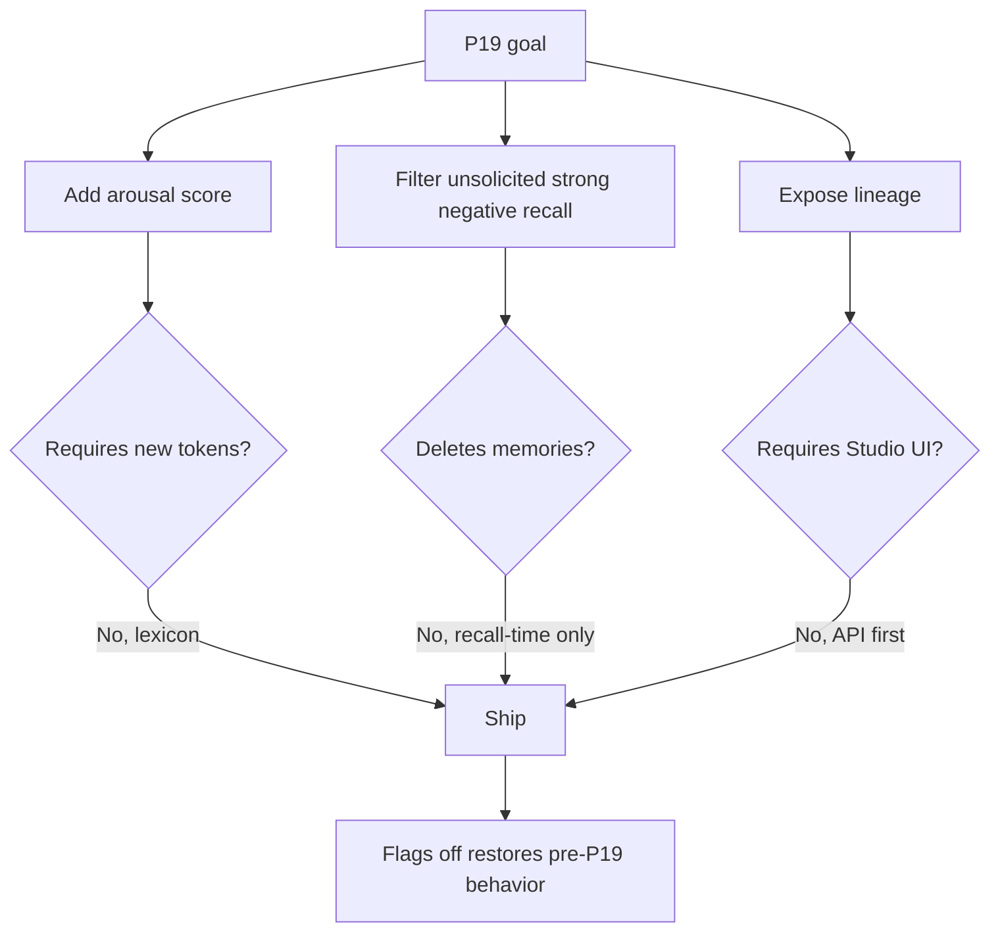
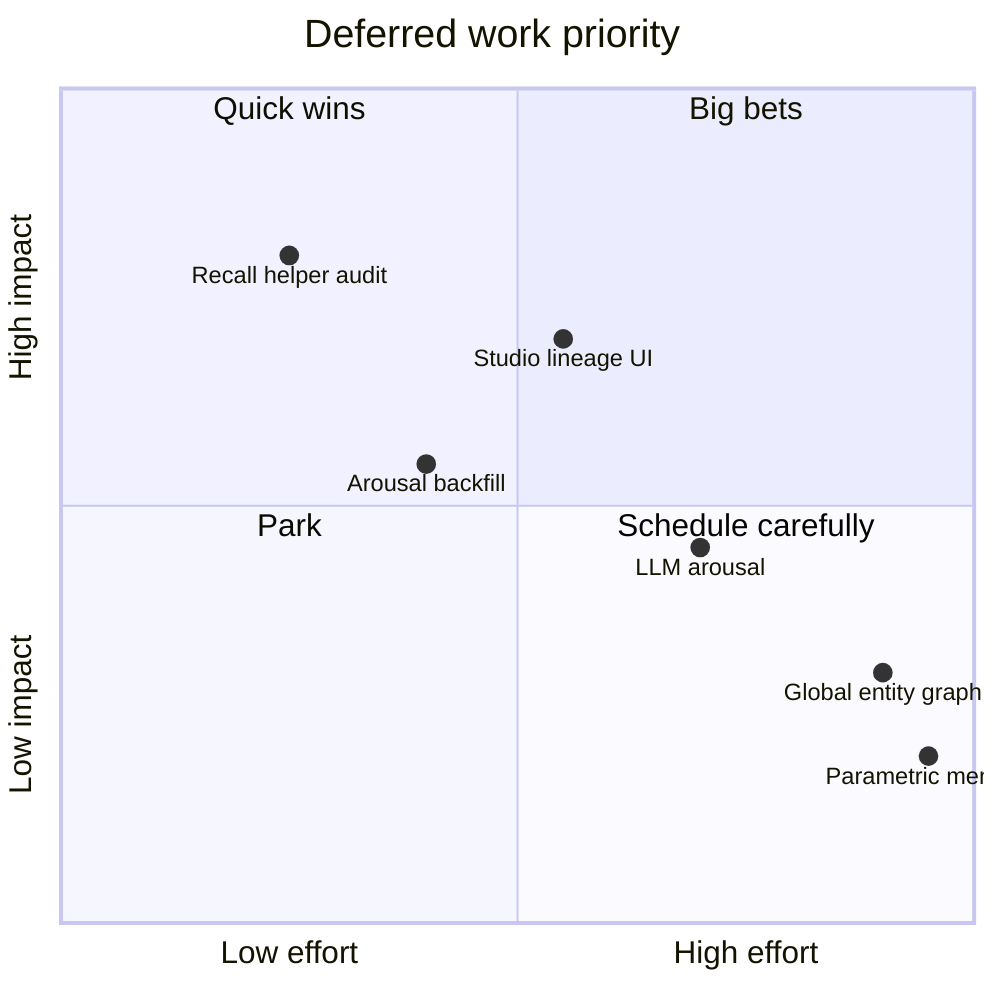
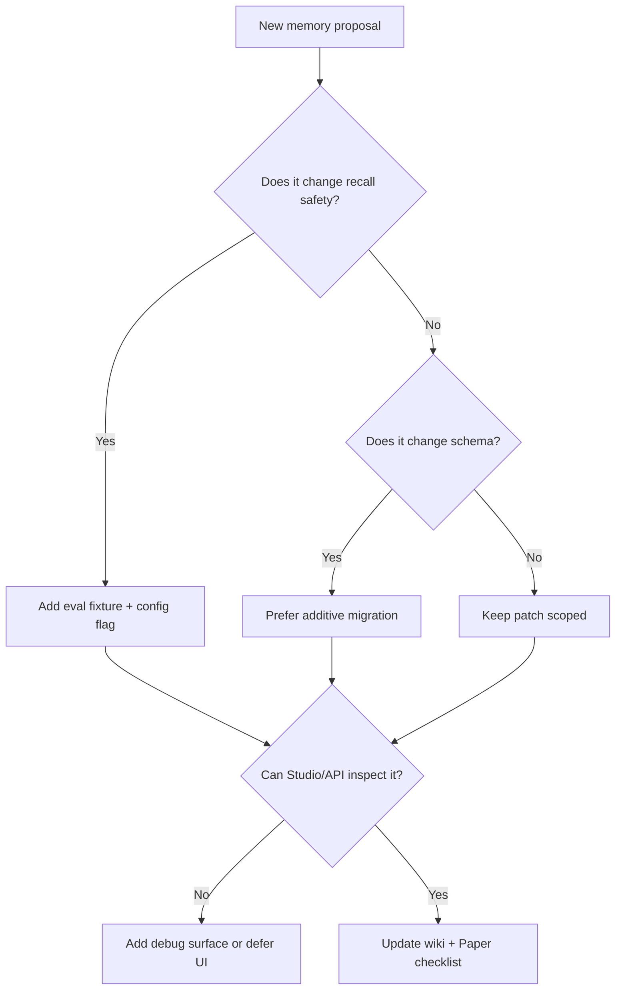

# Deferred after Phase 19

Items discussed for memory but **not** shipped in P19 (or only partial). Use this before opening the next memory PR.

Related: [[Memory-Architecture]] · [[Memory-Phases]] · [[Memory-Papers]]

---

## Not added (or partial)

| Item | Status | Why not | Suggested owner area |
|------|--------|---------|----------------------|
| Backfill `arousal_score` on legacy rows | Not done | NULL → rank bonus 0; full-text backfill deferred for Jetson migrate cost | Offline migration / eval |
| Dream / reflect / journal consume **arousal** | Explicit non-scope | P19 = write + rank + filter + lineage only; dream already uses valence/salience | Lifecycle |
| Monthly gate uses arousal | Not done | Paper I weights stay stable until design note revised | Research + config |
| Studio lineage **UI** (timeline) | API only | `GET …/lineage` enough for debug; full panel is front-end | Web UI |
| Hard filter on **all** recall entry points | Partial | End of `search`; some broad/recent helpers may skip | Backend audit |
| LLM-based arousal | Not done | Keep zero extra tokens; mirror valence later behind a flag | Extraction |
| Arousal −2 lexicon | Not done | Rank uses `abs(a)`; −2 ≈ +2 for ordering; little value until sign is used | Heuristics |
| Tune soft-avoid vs hard-filter weights | Defaults only | Needs live chat logs | Evaluation |
| Experience spreading full parity | Partial | Knobs exist; not P19 scope | Experience store |
| Cross-user global entity graph | Out of scope | Multi-user is path-isolated | Product/security |
| Physical delete of superseded vectors | Not done | Breaks lineage / Studio; needs explicit purge policy | Data retention |
| Parametric in-weight memory | Out of scope | Aiko is explicit SQLite memory | Research |
| Filesystem-as-memory agent trees | Out of scope | Different research track | Research |

---

## Why P19 stayed small



1. **Additive schema only** (`arousal_score`).
2. **Heuristic arousal** — no new LLM on write beyond extract.
3. **Filter is recall-time** — does not delete negative memories.
4. **Lineage is read-only** — audit first, UI later.

Flags off → pre-P19 behavior.

---

## Suggested next slices

```mermaid
journey
  title Next memory work slices
  section Stabilize P19
    Smoke test PR #97: 5: Maintainer
    Audit recall helper coverage: 4: Backend
  section Improve data quality
    Optional arousal backfill: 3: Tools
    Tune negative recall weights: 4: Eval
  section Improve UX
    Studio lineage timeline: 4: Frontend
    Daily journal 5x3: 3: Product
  section Research alignment
    Paper I arousal revision: 4: Research
```

1. Smoke test + merge PR #97.
2. Optional offline arousal backfill.
3. Hard filter on remaining recall helpers.
4. Studio chain panel consuming the lineage API.
5. Reflect / **daily journal 5×3**: cheer, grateful, remember, learned, experiences.
6. Paper I revision: optional `W_AROUSAL`; dual-axis affect section.
7. Eval for negative-filter precision/recall on chat logs.

---

## Priority matrix



---

## Decision flow for the next PR



---

Back: [[Home]] · [[Memory-Phases]]
