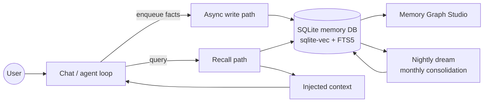
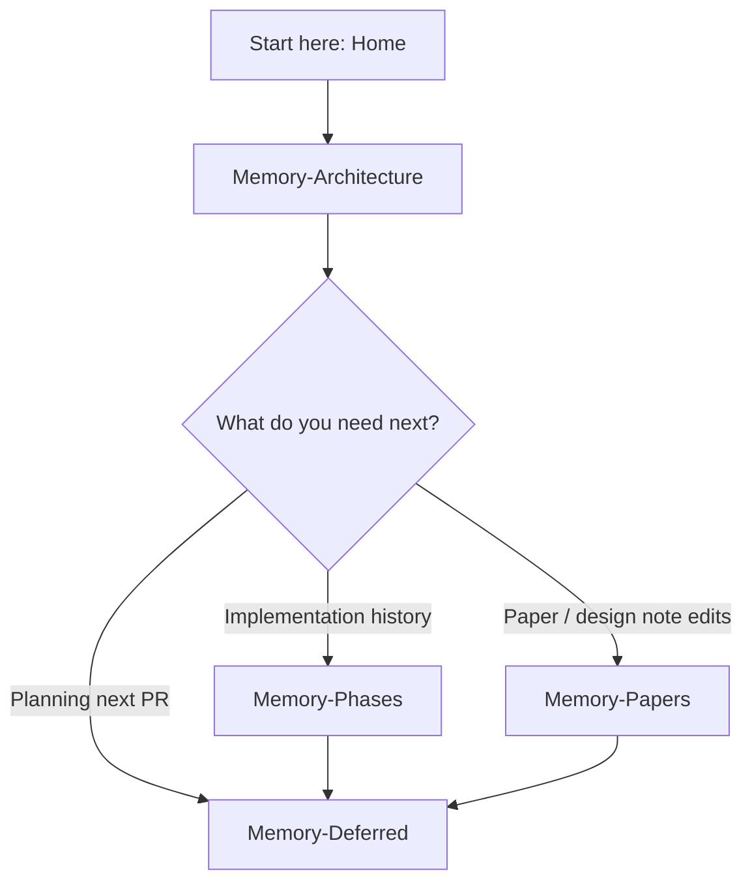

# Aiko-chan Wiki

Local-first AI companion — persistent memory, voice, VRM, and agentic tools.
Repo: [OppaAI/Aiko-chan](https://github.com/OppaAI/Aiko-chan)

---

## What this wiki covers

This wiki documents the **explicit memory stack**: how Aiko writes, recalls, filters, consolidates, and audits long-term memories. It is intentionally separate from the broader product roadmap (`Soul → Voice → Face → Presence`) so implementation notes stay focused and reviewable.

```mermaid
mindmap
  root((Aiko-chan Memory Wiki))
    [[Memory-Architecture]]
      Data model
      Write path
      Recall path
      Lifecycle
      Studio
    [[Memory-Phases]]
      P1 Core store
      P8 Tiered recall
      P12 Scenes
      P19 Arousal + lineage
    [[Memory-Deferred]]
      Non-goals
      Next slices
      Risk register
    [[Memory-Papers]]
      Paper I mapping
      Revision checklist
      Paper II ideas
```

---

## Page map

| Page | Best used for | Main diagrams |
|------|---------------|---------------|
| [[Memory-Architecture]] | Design goals, stores, write/recall flows, config, Studio surface | System overview, data model, sequence diagrams, lifecycle, lineage |
| [[Memory-Phases]] | “What landed when?” across P1–P19 | Timeline, capability matrix, phase dependency graph |
| [[Memory-Deferred]] | Scope control before the next memory PR | Deferred work funnel, priority matrix, decision flow |
| [[Memory-Papers]] | Paper I alignment and recommended design-note updates | Concept-to-code map, research update flow, affect model |

Status: **Phase 19** — arousal axis, negative hard filter, and lineage API. PR: [#97](https://github.com/OppaAI/Aiko-chan/pull/97).

---

## Architecture at a glance



### Capability snapshot

| Capability | Current state | Why it matters |
|------------|---------------|----------------|
| Local embeddings + FTS | Shipped | Runs on edge-class hardware without a separate vector service |
| Belief revision | Shipped | Lets Aiko update facts without silently rewriting history |
| Affect-aware ranking | Shipped | Supports more human-feeling recall while reducing unsolicited negative memories |
| Cross-store context | Shipped | Adds knowledge and experience around personal memories |
| Lineage API | Shipped | Enables auditability and future Studio timelines |
| Paper I refresh | Recommended | Keeps public/design narrative aligned with implemented P19 behavior |

---

## Quick links (repo)

* [README](https://github.com/OppaAI/Aiko-chan/blob/dev/README.md)
* [docs/ARCHITECTURE.md](https://github.com/OppaAI/Aiko-chan/blob/dev/docs/ARCHITECTURE.md)
* [docs/ROADMAP.md](https://github.com/OppaAI/Aiko-chan/blob/dev/docs/ROADMAP.md)
* [Memory Graph Studio](https://github.com/OppaAI/Aiko-chan/tree/dev/interface/webui/studio/memory)
* [AGi / AuRoRA](https://github.com/OppaAI/AGi) — larger cognitive architecture

---

## Recommended reading order



1. Start at [[Memory-Architecture]] for the system picture.
2. Use [[Memory-Phases]] when you need “what landed in which phase.”
3. Check [[Memory-Deferred]] before proposing the next memory PR.
4. Use [[Memory-Papers]] when revising design notes or Paper I.
