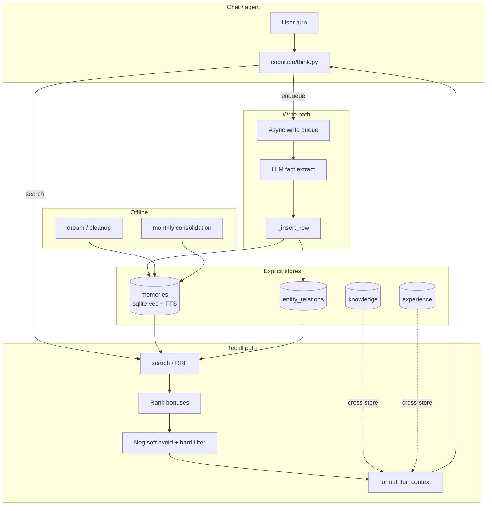
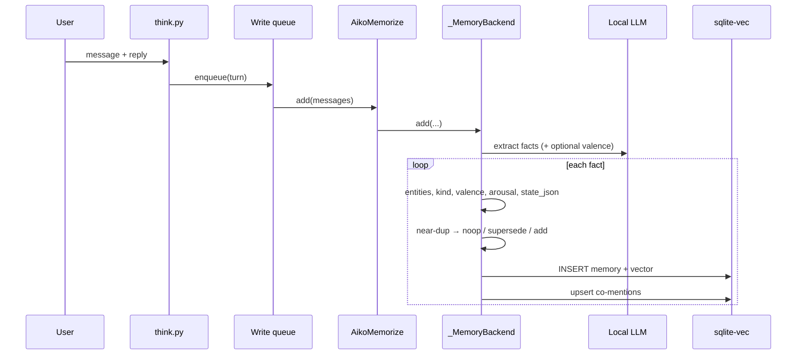
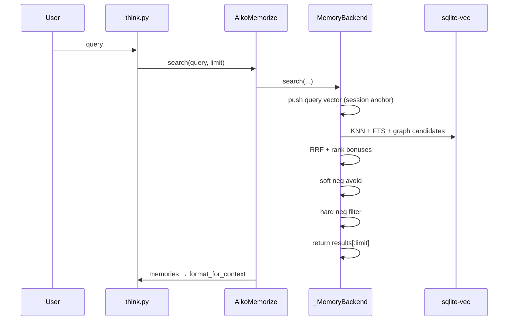
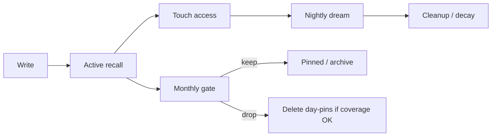
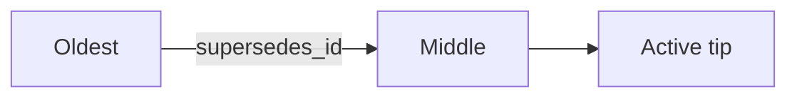

# Memory architecture

> Explicit, local-first long-term memory for Aiko-chan.  
> Edge-friendly (Jetson / 8GB class). Precursor patterns for **Grace / AuRoRA**.

Related: [[Memory-Phases]] · [[Memory-Deferred]] · [[Memory-Papers]]

---

## Design goals

| Goal | Approach |
|------|----------|
| **Edge-first** | In-process **sqlite-vec** + FTS5; Harrier GGUF/ONNX embeddings; no Qdrant/mem0 server |
| **Explicit memory** | Rows with clear write/read semantics (not only weights / KV cache) |
| **Belief revision** | `supersedes_id` + `status` — update without silent overwrite |
| **Affect-aware** | **Valence** (pleasant↔unpleasant) and **arousal** (calm↔activated) |
| **Human-feel recall** | Soft neg avoid + hard filter; session topic anchor; state tags |
| **Lifecycle** | Access tracking, decay, nightly dream, monthly retention gate |
| **Inspectable** | Memory Graph Studio + lineage API |

Design weights for monthly consolidation are cited in-repo as **Paper I** §5.2 (see [[Memory-Papers]]).

---

## System overview



### Primary code

| Role | Path |
|------|------|
| Facade | `cognition/memory/memorize.py` → `AikoMemorize` |
| Backend | `cognition/memory/backend.py` → `_MemoryBackend` |
| Lineage | `cognition/memory/lineage.py` |
| Session anchor | `cognition/memory/session_anchor.py` |
| Config | `config/memory.yaml` |
| Studio | `interface/webui/studio/memory/` |

---

## Data model (core columns)

| Column | Role |
|--------|------|
| `id`, `user_id`, `memory`, `created_at` | Identity + text |
| `access_count`, `last_accessed_at`, `access_day_count` | Practice / spacing |
| `pinned` | Immune to ordinary decay / prune |
| `status`, `supersedes_id` | Active vs superseded; belief chain |
| `kind`, `source`, `entities` | Fact/scene/…; origin; entity JSON |
| `scene_id` | L2 episode membership |
| `valence_tag`, `valence_score` | Polarity (−2…+2) |
| `salience_hit` | Cheap importance flag |
| `arousal_score` | Activation (−2…+2 schema; see note below) |
| `state_json` | Encode-time context (e.g. `local_hour`) |

Vectors: `memories_vec`. Co-mentions: `entity_relations`.

**Arousal note:** Schema and docs target a 5-point scale (−2…+2). The P19 lexicon currently emits **{−1, 0, +1, +2}** only (`−2` reserved). Rank uses `|arousal|`, so sign does not change ordering yet.

---

## Write path



* Extraction: LLM. Entities / kind: heuristics.  
* Valence: extract when `MEMORY_VALENCE_FROM_LLM=1`, else lexicon.  
* Arousal (P19): lexicon only when `MEMORY_AROUSAL_ENABLED=1`.  
* Writes are async so chat is not blocked by extract+embed.

---

## Recall path



Rank combines RRF (KNN + FTS + graph) with recency, access, pinned, entity importance, **arousal magnitude**, session boost, spreading, etc.

**Hard filter (P19):** drops strong-neg rows unless the query engages them (token overlap or emotion-seeking). Soft avoid only lowers score.

---

## Lifecycle



| Pass | Behavior |
|------|----------|
| Touch | Search bumps access counts / day count |
| Dream | Boost salient, merge near-dupes, prune decayed |
| Forget | Half-life can stretch with valence intensity |
| Monthly | Paper I weights + valence; provenance before delete |

---

## Affect axes

| Axis | Range | Role |
|------|-------|------|
| **Valence** | −2…+2 | Polarity; forget intensity; neg soft/hard policy |
| **Arousal** | −2…+2 | Activation; small rank bonus \(w \cdot \|a\|/2\) |

Orthogonal by design: calm positive ≠ excited positive. Mid-arousal lexicon drops bare tech noise (`bug` / `glitch` / `crash`).

---

## Lineage (P19)



* `walk_supersession_lineage` — back via `supersedes_id`, forward via `find_by_supersedes`  
* `AikoMemorize.get_lineage` → Studio `GET /api/memory/{id}/lineage`  
* Depth: `MEMORY_LINEAGE_MAX_DEPTH` (default 32)

---

## Key config (P16–P19)

```yaml
MEMORY_VALENCE_FROM_LLM: "1"
MEMORY_AROUSAL_ENABLED: "1"
MEMORY_AROUSAL_RANK_WEIGHT: "0.08"

MEMORY_NEG_RECALL_AVOID: "1"
MEMORY_NEG_RECALL_AVOID_WEIGHT: "0.015"
MEMORY_NEG_HARD_FILTER: "1"
MEMORY_NEG_HARD_THRESHOLD: "-1"

MEMORY_LINEAGE_MAX_DEPTH: "32"
MEMORY_STATE_TAGS_ENABLED: "1"
MEMORY_SUPERSESSION_NARRATIVE: "1"
```

Flags off → prior-phase behavior (additive schema only).

---

## Studio

```bash
uv run python -m interface.webui.studio.memory.backend.api
# → http://127.0.0.1:8001
```

Graph: memories, entities, knowledge, experience.  
P19: lineage endpoint for ordered supersession chains.

---

## Relation to AuRoRA

| Aiko | AGi analogue |
|------|----------------|
| sqlite-vec + rank | MSB |
| search + context assembly | MCC |
| facts / scenes | EMC-like |
| experience store | PMC traces |
| entity graph | SMC connectivity |

---

Next: [[Memory-Phases]] · [[Memory-Deferred]] · [[Memory-Papers]]
