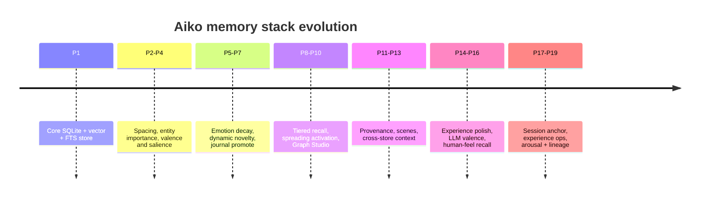
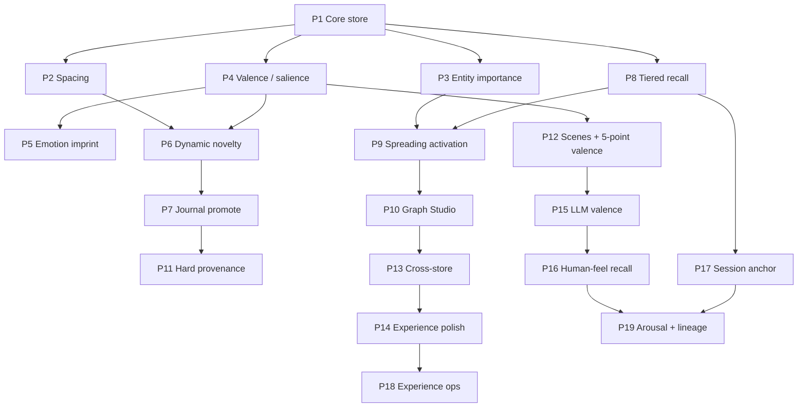
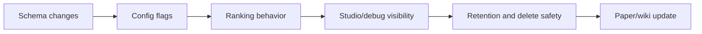

# Memory phases (P1–P19)

Feature phases for the **memory stack** (not product roadmap phases in `docs/ROADMAP.md`).

See also: [[Memory-Architecture]] · [[Memory-Deferred]]

---

## Phase timeline

---

## Table

| Phase | Theme | Implementation details | Primary user-visible effect |
|-------|-------|------------------------|-----------------------------|
| **P1** | Core store | sqlite-vec + FTS5; Harrier embed; LLM fact extract; user-scoped DB; chat inject; replace mem0/Qdrant | Aiko can remember explicit facts locally |
| **P2** | Spacing | `access_day_count` — distinct local days recalled (spaced-repetition signal for monthly gate) | Recalled-on-many-days facts become stickier |
| **P3** | Entity importance | Rank term from entity importance map (`MEMORY_RANK_ENTITY_IMPORTANCE_WEIGHT`) | Important people/topics rank higher |
| **P4** | Valence / salience | `valence_tag`, `valence_score`, `salience_hit`; monthly `W_VALENCE` blended with Paper I weights | Emotional and salient memories get better treatment |
| **P5** | Emotion imprint | `FORGET_EMOTION_GAMMA`; intensity by tag; dream prefers stored tags | Emotional memories decay more carefully |
| **P6** | Dynamic novelty anchors | Static archive anchors + dynamic mean of recent active vectors for monthly novelty | Novel but relevant memories survive better |
| **P7** | Journal promote | Optional promote of journal fragments before retention gate; safer day-pin delete coverage | Daily notes can become durable memories |
| **P8** | Rank / tiered recall | RRF KNN+FTS+graph; quick→wide; recency-among-relevant; score thresholds | Recall gets faster, broader, and less noisy |
| **P9** | Spreading activation | Walk `entity_relations`; depth/decay/min strength; extra neighbor memories + score weight | Related memories can surface through connected entities |
| **P10** | Memory Graph Studio | Galaxy UI; nodes/edges export; filters (status, valence, retain, entity) | Memory becomes inspectable and debuggable |
| **P11** | Hard provenance | Monthly delete requires LLM `source_ids` coverage of kept day-pins | Safer consolidation before deleting day-pins |
| **P12** | Scenes + 5-point valence | L2 `scene_id` / `kind=scene`; expand on recall; `valence_score` −2…+2 | Episodes recall with richer context |
| **P13** | Cross-store | Attach related knowledge + experience after personal recall; Studio node types | Personal memory gains factual and experiential context |
| **P14** | Experience store polish | Experience DB RAG for agent runs; auto-relate threshold; entity boost | Agent traces become reusable context |
| **P15** | LLM valence on extract | `MEMORY_VALENCE_FROM_LLM`; extract can supply `valence_score`; Studio contrast | Better affect labels when enabled |
| **P16** | Human-feel recall | `state_json`; soft `MEMORY_NEG_RECALL_AVOID`; supersession narrative; Studio dims superseded | Less jarring recall and clearer updated facts |
| **P17** | Session dynamic anchor | Rolling mean of last-K **query** embeddings; rank boost toward current chat topic | Current conversation theme influences recall |
| **P18** | Experience / spreading ops | Config + wiring for experience supersede / spreading knobs | More controllable experience graph behavior |
| **P19** | Arousal + hard filter + lineage | `arousal_score` write + rank bonus; sticky-neg hard filter; `lineage.py` + Studio route | Safer affect-aware recall and auditable belief chains |

---

## Capability matrix

| Capability area | Early phases | Middle phases | Late phases |
|-----------------|--------------|---------------|-------------|
| Storage | P1 local DB and vectors | P12 scenes | P13+ cross-store graph |
| Ranking | P2 spacing, P3 entities | P8 RRF, P9 spreading | P17 session anchor, P19 arousal |
| Affect | P4 valence/salience | P5 emotion decay, P12 5-point valence | P15 LLM valence, P19 arousal/filter |
| Safety / audit | P1 explicit rows | P11 provenance | P16 supersession narrative, P19 lineage |
| UX / tooling | Chat injection | P10 Studio | P19 lineage API for future timeline |

---

## Dependency graph

---

## Review checklist by phase family

| Before merging a new memory phase | Ask |
|----------------------------------|-----|
| Schema | Is the migration additive and safe for existing DBs? |
| Config | Can flags restore prior behavior? |
| Recall | Does ranking change only intended entry points? |
| Safety | Are negative/sensitive memories filtered at recall, not destroyed unexpectedly? |
| Studio | Can a developer inspect the new state? |
| Docs | Does [[Memory-Papers]] need an update? |

---

Back: [[Home]] · [[Memory-Architecture]]
