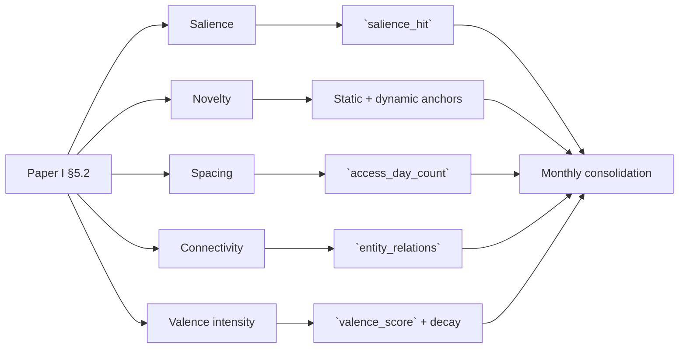
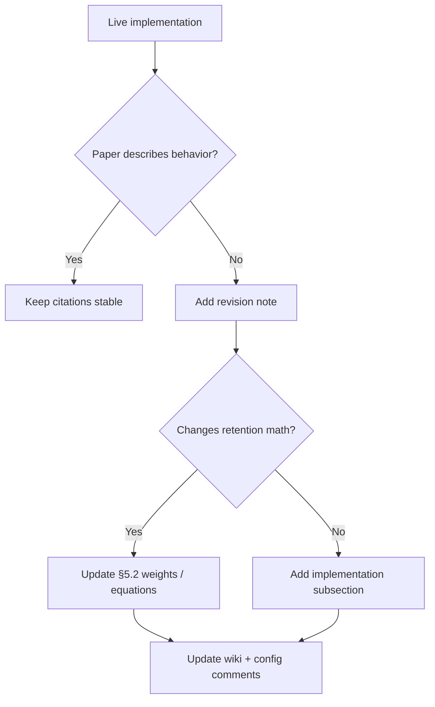
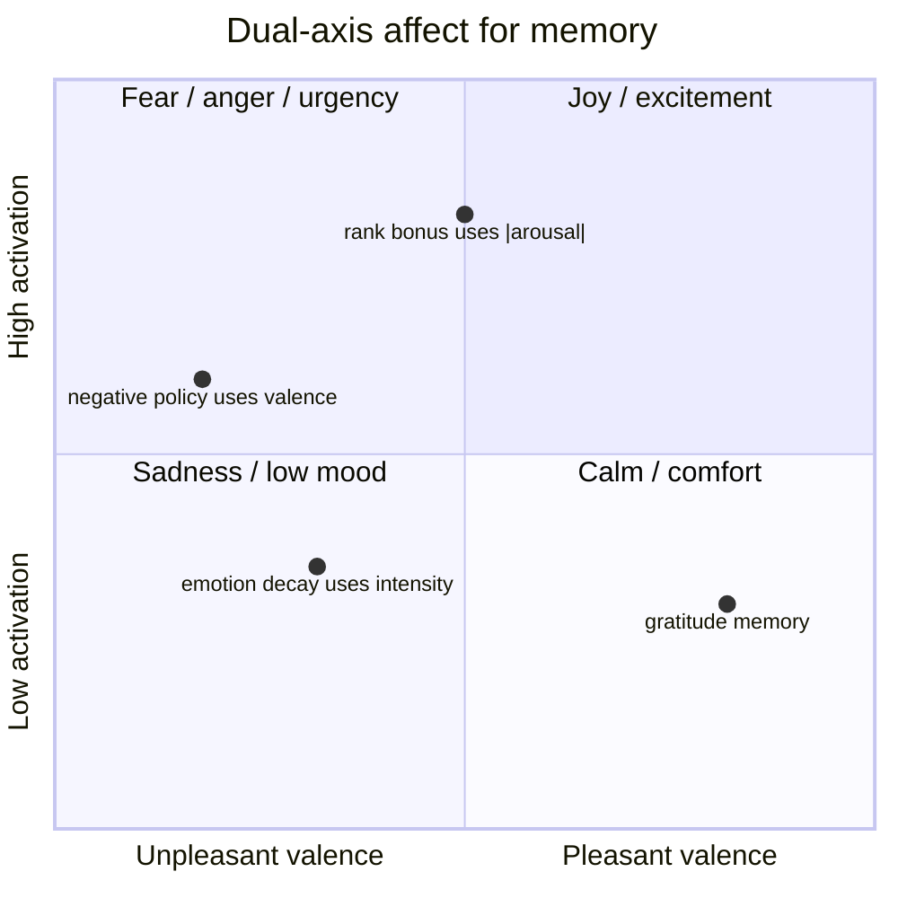
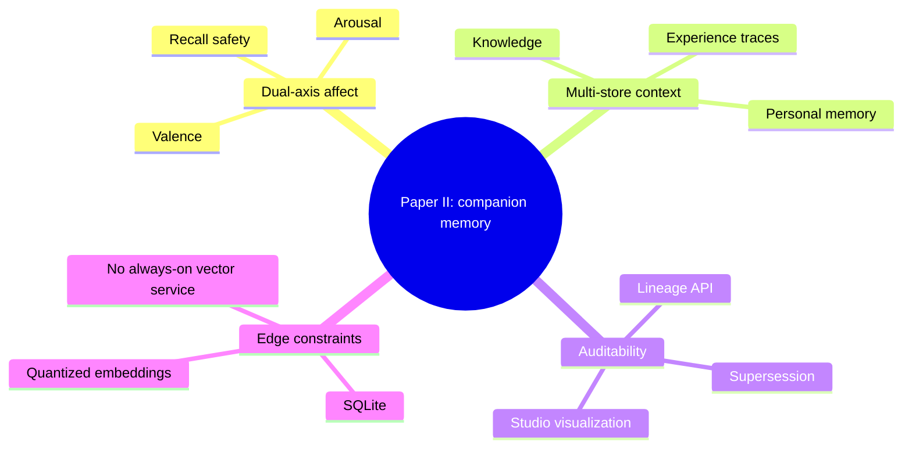

# Papers and design notes

How the **running memory stack** relates to **Paper I** (cited in `config/memory.yaml`) and what to update.

Related: [[Memory-Architecture]] · [[Memory-Deferred]]

> If Paper I lives outside the public repo (private draft / OSF), treat this page as a **revision checklist**, not a claim of a public arXiv URL.

---

## What the code cites

From `config/memory.yaml`:

```text
# Paper I §5.2 weights (salience/novelty/spacing/connectivity), with W_VALENCE blended in.
MONTHLY_CONSOLIDATION_W_SALIENCE: "0.30"
MONTHLY_CONSOLIDATION_W_NOVELTY: "0.25"
MONTHLY_CONSOLIDATION_W_SPACING: "0.20"
MONTHLY_CONSOLIDATION_W_CONNECTIVITY: "0.25"
MONTHLY_CONSOLIDATION_W_VALENCE: "0.10"
```

Also implemented in the spirit of that note:

* **Dynamic anchors (P6)** — novelty vs static `[YYYY-MM]` archives + dynamic mean of recent active vectors.
* **Emotion-modified decay (P5)** — effective half-life stretched by valence intensity.
* **Soft monthly threshold** — retention gate (~0.44).

---

## Concept → code map



| Paper I concept (as used in config) | Code | Phase |
|-------------------------------------|------|-------|
| Salience | `salience_hit`; monthly `W_S` | P4+ |
| Novelty (static + dynamic) | Monthly novelty | P6 |
| Spacing | `access_day_count` | P2, P6 |
| Connectivity | Entity graph / importance | P3, P9 |
| Valence intensity | `valence_score` / tag; forget + `W_V` | P4–P15 |
| Consolidation / archive | Monthly facts; day-pin policy | P7, P11 |
| Explicit external store | sqlite-vec | P1 |

### In code but not yet in Paper I (as cited)

| Concept | Phase | Paper impact |
|---------|-------|--------------|
| Arousal axis + rank bonus | **P19** | Add dual-axis affect model and clarify `abs(arousal)` ranking |
| Hard neg filter (unsolicited suppress) | **P19** | Describe as recall policy, not retention/deletion |
| Soft neg avoid | P16 | Explain score lowering before hard filtering |
| Session query-mean anchor | P17 | Separate online chat-topic anchoring from monthly novelty |
| Supersession lineage API | P19 | Add belief-revision audit trail |
| Cross-store knowledge / experience | P13+ | Explain multi-store context without over-claiming one unified brain |
| Spreading activation | P9 | Connect entity graph to candidate expansion |

---

## Do papers need an update?

**Yes**, if Paper I is the system-of-record description. The live system is ahead on dual-axis affect and recall safety policy.



### Suggested Paper I edits

1. **Affect** — Valence vs arousal; rank uses `|a|`; monthly still valence-primary until `W_AROUSAL` is proposed.
2. **§5.2** — Document five-term blend; optional future `W_AROUSAL` defaulting to 0; hard filter is **recall policy**, not a gate input.
3. **Belief revision** — `supersedes_id` chains; lineage for audit/Studio.
4. **Human-feel recall** — Soft avoid vs hard filter; session anchor ≠ monthly dynamic novelty anchor.
5. **Edge constraints** — Explicit SQLite vs parametric long-term memory research.
6. **Version table** — Point at [[Memory-Phases]] (P1–P19).

---

## Proposed affect-model wording



Suggested concise paragraph:

> The memory store represents affect with two orthogonal axes. Valence estimates pleasantness or unpleasantness and participates in emotion-modified decay and negative-recall policy. Arousal estimates activation or urgency and may provide a bounded ranking bonus by magnitude. Retention remains governed by the Paper I salience/novelty/spacing/connectivity blend plus valence until an explicit arousal retention weight is introduced.

---

## Optional “Paper II” sketch



* Dual-axis affect at encode and rank.
* Companion inject safety filters.
* Multi-store memory / knowledge / experience without over-claiming one brain model.
* Auditable belief revision through supersession lineage.

---

## Summary

| Question | Answer |
|----------|--------|
| Is code ahead of Paper I? | **Yes** |
| Block engineering merge on paper rewrite? | **No** |
| Minimal paper fix | Dual-axis affect + recall policy ≠ retention gate + P19 footnote |
| Best next doc task | Add a P19 subsection and a small version table |

---

Back: [[Home]] · [[Memory-Architecture]]
