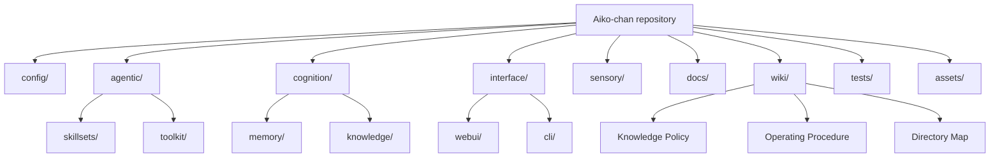
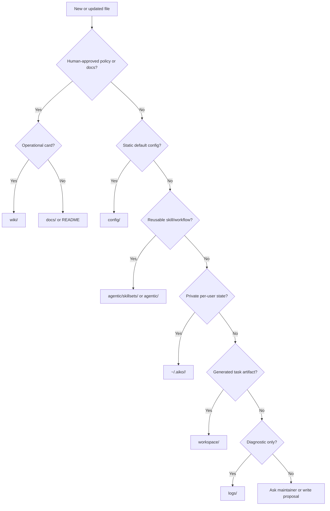
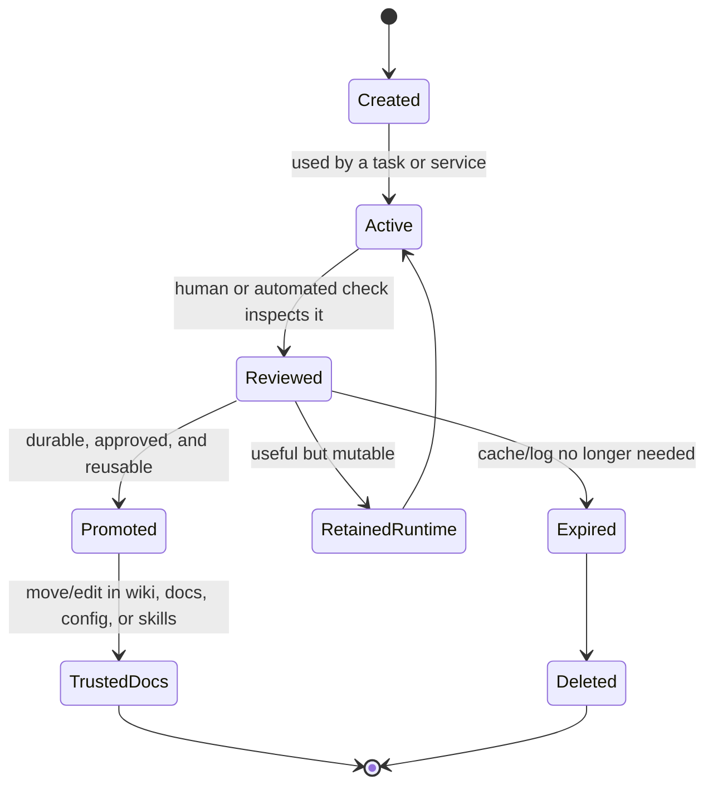
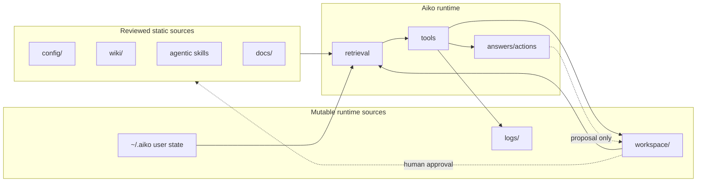

# Runtime State

Purpose: keep Aiko from mixing user settings, runtime state, and generated work. This page is the map for deciding where files belong and which directories are safe for durable human-maintained policy versus mutable runtime artifacts.

## Directory Meanings

| Path | Owner | Mutability | Belongs here | Does not belong here |
| --- | --- | --- | --- | --- |
| `config/` | Human maintainer | Mostly static | Defaults, settings, policy knobs | User-created schedules, logs, generated reports |
| `agentic/` | Human maintainer | Mostly static | Workflows, skillsets, tool registry, agentic orchestration | Per-user task state |
| `wiki/` | Human maintainer | Reviewed changes only | Operational routing cards and examples Aiko can retrieve before acting | Auto-generated drafts, private memory |
| `docs/` | Human maintainer | Reviewed changes | Project documentation, install guides, architecture references | Runtime caches or secrets |
| `workspace/` | Aiko/tools/user | Mutable | Generated notes, reports, task artifacts, proposals | Trusted policy without review |
| `logs/` | Runtime | Mutable/ephemeral | Diagnostics and trace output | Durable user facts or policy |
| `~/.aiko/<user_id>/` | User/runtime | Mutable/private | Per-user memory, schedules, reminders, state | Shared config or repo policy |

## Repository Layout Overview



## File Placement Decision Tree



## Schedule Files

Keep scheduler defaults in `config/schedule.yaml`.

Keep user-created scheduled jobs in `~/.aiko/<user_id>/tasks/schedule.json`. This file is runtime state: Aiko and the scheduler update it while running. It should stay in the per-user state directory, not in config or shared workspace directories.

Do not move `~/.aiko/<user_id>/tasks/schedule.json` into `config/` just because it looks like settings. It contains mutable jobs, not static defaults.

A direct tool job is data-only and may select any registered agentic tool:

```json
{
  "title": "daily_job_post_social",
  "time_of_day": "09:00",
  "frequency": "daily",
  "action": "tool",
  "tool_call": {"name": "draft_job_post_social", "arguments": {}}
}
```

For an `agentic` job, the optional `skill` field can contain custom `SKILL.md`-style Markdown instructions. The scheduler supplies it with the task when the job fires. Tool names are restricted to the existing agentic tool registry; schedule files cannot run arbitrary Python.

## State Lifecycle



## Data Flow Boundaries



## When To Use Runtime

Use a runtime directory only for cache-like files that can be deleted and regenerated safely. User-created schedules, reminders, reports, and notes are not cache; keep them in workspace or the per-user state directory according to privacy and sharing needs.

## Practical Examples

| Scenario | Correct location | Reason |
| --- | --- | --- |
| A user asks Aiko to write a research report | `workspace/` | Generated artifact that may be revised or deleted |
| A maintainer approves a new routing rule | `wiki/` | Trusted operational policy |
| A default web UI setting changes | `config/` | Static configuration default |
| A user creates a daily reminder | `~/.aiko/<user_id>/tasks/` | Private mutable state |
| A failed tool call writes diagnostics | `logs/` | Ephemeral troubleshooting evidence |
| A reusable job-hunting workflow is formalized | `agentic/skillsets/` | Repeatable skill instructions |
