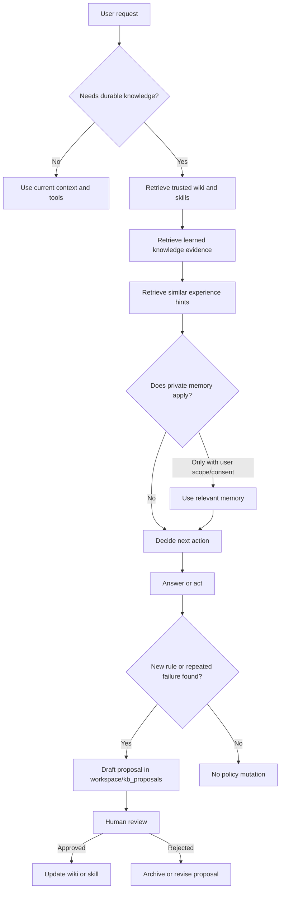
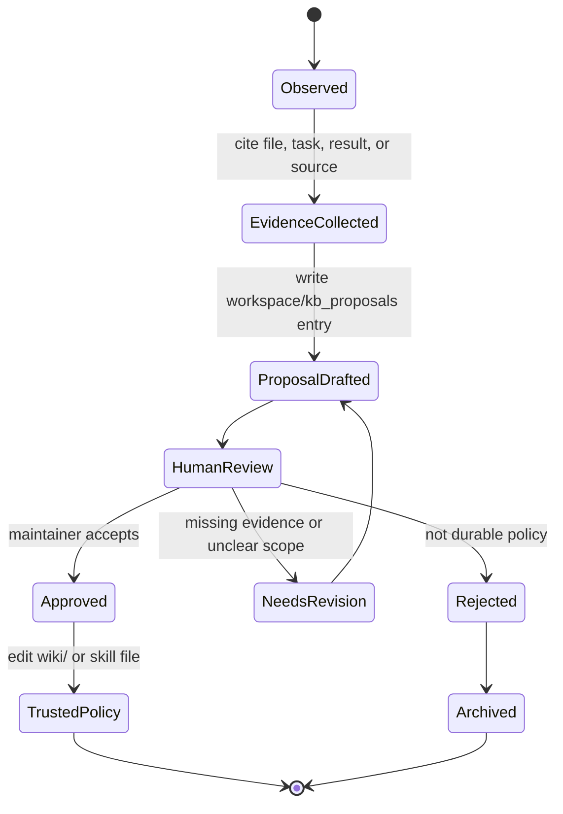
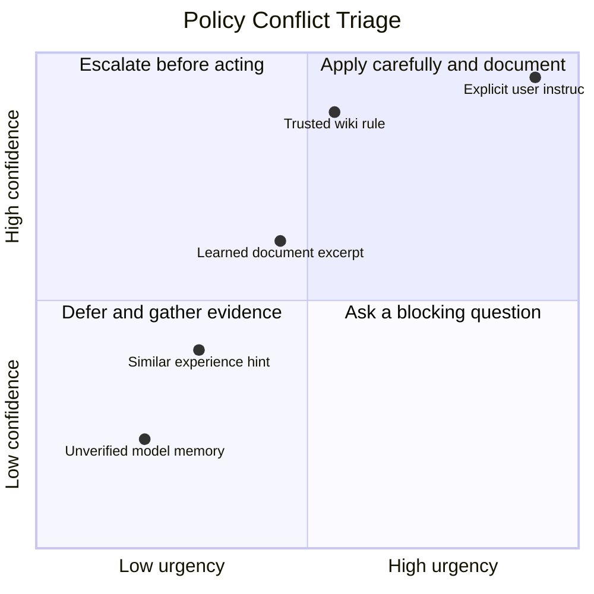
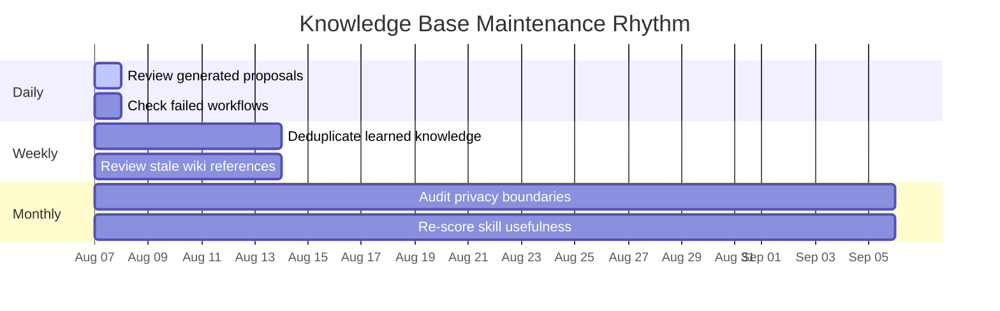

# Knowledge Base Governance

Purpose: make Aiko's wiki, learned knowledge, memory, and experience grow without mixing trust levels. This page is the source of truth for how Aiko decides what can be treated as policy, what can be treated as evidence, and what must remain private or review-only.

## Governance Goals

- Keep human-approved operating rules stable, auditable, and easy to retrieve.
- Let Aiko learn from documents, repeated tasks, and failures without silently changing trusted instructions.
- Separate private user memory from reusable project knowledge.
- Preserve provenance so future answers can explain why a fact or workflow was used.
- Make proposed changes visible before they become policy.

## Trust Levels

| Level | Store | Typical writer | Used for | Authority | Review needed? |
| --- | --- | --- | --- | --- | --- |
| Trusted policy | `wiki/`, approved skills | Human maintainer | Operating rules, routing policy, durable procedures | Highest | Yes, before edits land |
| Skill defaults | `agentic/skillsets/`, `agentic/SKILLS.md` | Human maintainer | Repeatable task workflows and tool preferences | High for named workflows | Yes |
| Learned knowledge | Knowledge vector store | Tools or approved imports | RAG evidence from PDFs, docs, notes, and research | Evidence only | Sometimes, for policy promotion |
| Experience | Experience vector store | Automated task traces | Similar workflow hints, known failures, successful tool sequences | Advisory | No, but can generate proposals |
| Memory | Per-user memory store | User or memory tools | Private preferences and personal facts | User-scoped | User consent for reuse |
| Runtime artifacts | `workspace/`, `logs/`, caches | Aiko, tools, runtime | Reports, drafts, diagnostics, generated task output | Temporary evidence | Yes, before policy promotion |
| Proposed policy | `workspace/kb_proposals/` | Aiko or maintainer | Draft changes awaiting review | Not authoritative | Yes |

## Trust Boundary Diagram

## Knowledge Promotion Pipeline

Use this pipeline when Aiko discovers a missing instruction, stale guidance, repeated correction, or reusable workflow.

## Update Rule

Aiko should not silently rewrite trusted wiki or skill files during normal work. Learned knowledge and experience may be written by tools, but they must not overwrite human policy. When she discovers a missing rule, stale instruction, repeated failure, or useful new workflow, she should draft a proposal under `workspace/kb_proposals/` with:

1. the problem or failure that triggered the proposal,
2. source evidence or file paths,
3. the suggested wiki/skill change,
4. confidence and freshness notes,
5. whether human approval is needed.

## Evidence Quality Checklist

Before promoting anything from learned knowledge, memory, or experience into trusted policy, check:

- **Source:** Is the source human-authored, tool-generated, imported from a document, or inferred from behavior?
- **Freshness:** Is the evidence still current, or does it depend on changing tools, APIs, schedules, or laws?
- **Scope:** Does the rule apply globally, to one user, to one skill, or to one task?
- **Privacy:** Does it include user-specific memory or secrets that must stay out of shared wiki files?
- **Conflict:** Does it contradict existing wiki, skill, config, or user instructions?
- **Actionability:** Is the proposed rule specific enough for Aiko to follow without guessing?

## Conflict Resolution Matrix

When instructions conflict, priority order is: explicit user request > direct system/developer policy > trusted skill/wiki policy > learned knowledge evidence > similar experience hints > general model knowledge.

## Lint Rule

Run `python -m kb.lint` after editing wiki or skill documents. Wiki cards need front matter with `id`, `name`, `summary`, `status`, and `owner`. Skill documents need `id`, `name`, `summary`, `triggers`, and `tools`.

## Retrieval Rule

Normal chat may retrieve wiki and learned knowledge for Aiko/self-knowledge questions. Agentic mode should retrieve relevant policy, wiki, skills, memory, learned knowledge, and similar experience after task intent is confirmed and before choosing tools. Priority order is: explicit user request > trusted skill/wiki policy > learned knowledge evidence > similar experience hints > general model knowledge.

## Maintenance Cadence

