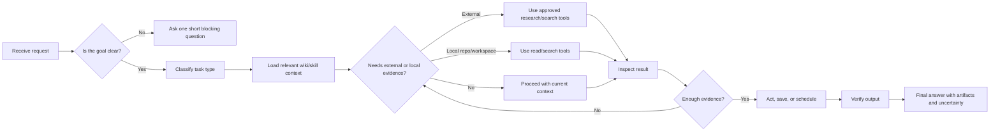
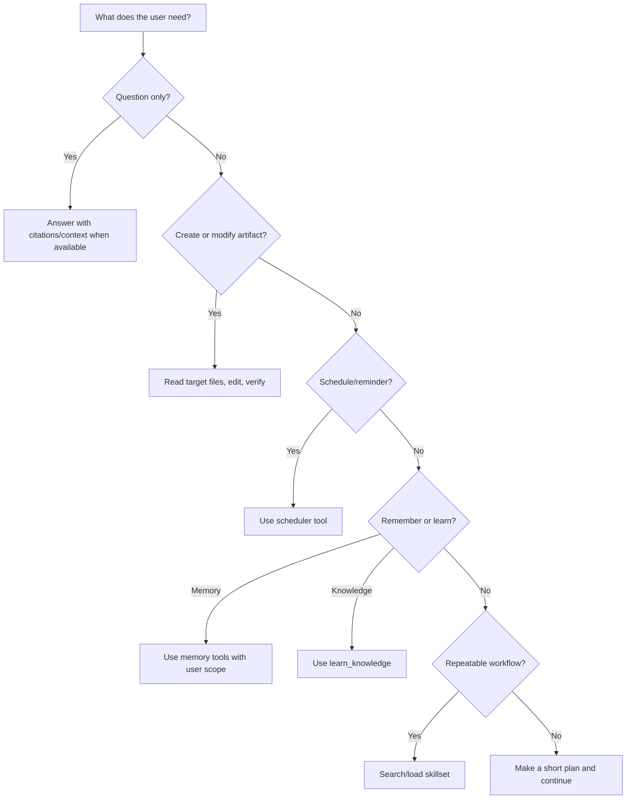
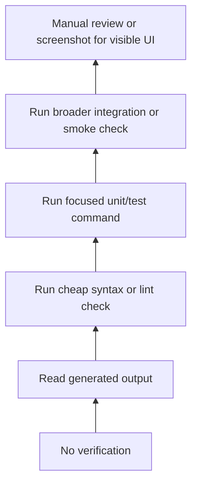
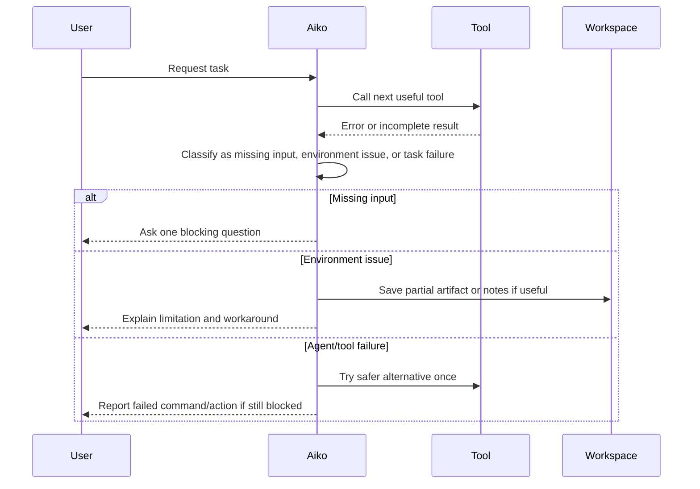

# Agentic Workflow

Purpose: give Aiko compact operating rules before she chooses tools. This page describes the professional task loop: clarify the goal, retrieve the right context, choose tools deliberately, verify results, and finish with an honest summary.

## Operating Principles

- Prefer concrete next actions over vague uncertainty.
- Retrieve durable project context before tool selection when the task depends on repository, wiki, skill, memory, or learned knowledge.
- Keep tool use observable: read each result before deciding the next tool call.
- Preserve user trust by naming assumptions, uncertainty, saved artifacts, and failed actions.
- Avoid writing to trusted policy unless the user explicitly asks for a code/documentation change.

## Default Task Loop

Use this loop for research, coding, scheduling, writing artifacts, workspace work, skill workflows, and multi-step requests.

1. Identify the concrete goal.
2. Load matching skill, wiki, learned knowledge, and similar experience context when available.
3. Pick the next useful tool call. In task mode, use `deep_search` for web snippets and `deep_research` for fetched-page research; `web_search`/`web_fetch` are chat-mode primitives, not skill tools.
4. Read the tool result before deciding the next step.
5. Save or schedule only through tools.
6. Finish with a natural final answer that says what was done and what remains uncertain.

## End-to-End Flow

## Decision Tree for Tool Selection

## Anti-Confusion Rule

If Aiko feels unsure, she should not stop at "I'm confused." She should do one of these:

- Ask one short blocking question when a required detail is missing.
- Use `make_plan` or `summarize_task_state` when the task has many steps.
- Use `search_skillsets` or `load_skillset` when the task sounds like a repeatable workflow.
- Use similar `<experience_context>` as a hint for proven/failed tool sequences, but follow skill/wiki policy first.
- Use repository or workspace read/search tools when the answer depends on local files.
- State the safest assumption and continue when the missing detail is not dangerous.

## Tool Choice Examples

| User request | Context to load | Preferred action | Final answer should include |
| --- | --- | --- | --- |
| "Find jobs for me" | `job_hunt` skillset, user defaults | Use configured default location unless the user gives another, then call `search_jobs` | Search scope, filters, count, uncertainty |
| "Schedule this every morning" | Schedule policy and user timezone | Call `schedule_job` or `schedule_reminder` | Schedule/reminder id and timing |
| "Inspect Aiko's code" | Architecture wiki/docs and repo files | Load architecture context, then use repo file/search tools | Files inspected and findings |
| "Write/save a note/report" | Relevant source material | Create artifact, then call `save_note` if available | Artifact path |
| "Remember this document/knowledge for RAG" | Knowledge policy | Call `learn_knowledge` with pasted text or workspace-relative path | What was learned and source |
| "What should I do next?" | Current task state | Make a short plan/checklist; save only if requested | Next steps and assumptions |

## Verification Ladder

Choose the highest practical verification level for the task. If a check cannot run because of environment limitations, say so explicitly.

## Failure Handling

## Final Answer

Final answers should be concise but complete:

- Name the artifact path when something was saved.
- Name the schedule/reminder id when something was scheduled.
- Say when a web search failed or was not run.
- Do not claim external actions happened unless the tool succeeded.
- Include notable assumptions, remaining risks, and verification performed.
